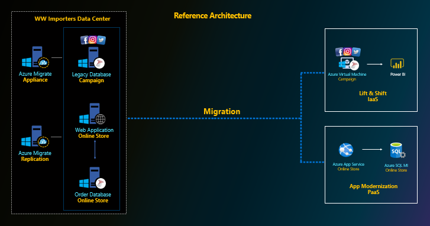
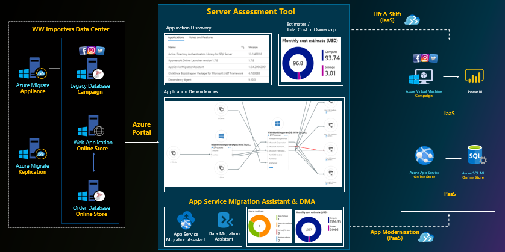

# Azure Migrate
**Azure Migrate** provides a centralized hub to **assess** and **migrate** to Azure on-premises servers, infrastructure, applications, and data.
## Azure Migrate provides the following features:
* **Unified migration platform:** A single portal to start, run, and track your migration to Azure.
* **Range of tools:** A range of tools for assessment and migration. Tools include Azure Migrate: Server Assessment and Azure Migrate: Server Migration. Azure Migrate integrates with other Azure services and with other tools and independent software vendor (ISV) offerings.
* **Assessment and migration:** In the Azure Migrate hub, you can assess and migrate:
    * **Servers:** Assess on-premises servers and migrate them to Azure virtual machines.
    * **Databases:** Assess on-premises databases and migrate them to Azure SQL Database or to an Azure SQL Database managed instance.
    * **Web applications:** Assess on-premises web applications and migrate them to Azure App Service by using the Azure App Service Migration Assistant.
    * **Virtual desktops:** Assess your on-premises virtual desktop infrastructure (VDI) and migrate it to Windows Virtual Desktop in Azure.
    * **Data:** Migrate large amounts of data to Azure quickly and cost-effectively using Azure Data Box products.

## Scenario
<kbd>
  
</kbd>

## Demo Steps
<kbd>
  
</kbd>

### **1. Lift & Shift**
**Lift and shift**, also known as **rehosting**, is the process of migrating an exact copy of an application or workload (and its data store and OS) from IT one environment to another-usually from on-premises to public or private cloud.

- This demo will be focused on describing the Assessment and Migration of source Server on azure cloud. With enormous capability of **Azure Migrate**.
- We can assess server which has any types of database which are pointing to any web application and Migrate them using Azure Migrate Migration Tool.
- Before migration, server assessment is done using
    - Azure Migrate: Server Assessment
        >- Discover installed applications, roles, and features with the Server Assessment tool in Azure Migrate.
- After assessment, server migration is done using
    - Azure Migrate: Server Migration
        >- Migrate VM-Ware VMs, Hyper-V VMs, physical servers, other virtualized machines, and public cloud VMs to Azure.

### **2. App Modernization**
Modernization is all about transforming your legacy, monolithic applications into something more agile, more elastic, and with higher availability.
A modernized, cloud hosted application drastically reduces hardware and infrastructure cost and at the same time can improve application uptime to 99.9%.
- This demo will be focused on describing the Assessment and Migration of source Server, Applications and Databases on Azure cloud. With enormous capability of **Azure Migrate**
    - Data Migration Assistant
        >- The Data Migration Assistant (DMA) helps you upgrade to a modern data platform by detecting compatibility issues that can impact database functionality in your new version of SQL Server or Azure SQL Database.
        >- DMA recommends performance and reliability improvements for your target environment and allows you to move your schema, data, and uncontained objects from your source server to your target server.

    - App Service Migration Assistant
        >- The Migration Assistant tool is a local agent that performs a detailed assessment and then walks you through the migration process.

### Before starting the demo please prepare source infrastructure according to the following prerequisites.
**Prerequisites**  

* For performing assessment, user needs to [setup](prerequisites/appliance-setup.md) Azure Migrate Appliance on Azure VM.

* For performing migration, user needs to [prepare](https://docs.microsoft.com/en-us/azure/migrate/tutorial-migrate-physical-virtual-machines) a machine for the replication appliance on Azure VM.

> Note: Make sure you have configured appliance and Replication Server on Azure VM before following operation for server assessment and migration. 

*Duration 45 Minutes*

### Demo 1: Assessment
##### a. Lift & Shift 
* [Wide World Importers legacy database](assess/wwi-ecomm-db-legacy.md)
##### b. App Modernization 
* [Wide World Importers database](assess/wwi-ecomm-db.md)
* [Wide World Importers application](assess/wwi-ecomm-app.md)  

    > [Lab demo](http://ftp-repos.click2cloud.net/Videos/1-Azure-Migrate-Assessment.mp4) for Azure Migrate Lift & Shift and App Modernization Assessment.

### Demo 2: Migration
##### a. Lift & Shift 
* [Wide World Importers legacy database](migrate/wwi-ecomm-db-legacy.md)  

    > [Lab demo](http://ftp-repos.click2cloud.net/Videos/2-Lift-and-Shift-Migration.mp4) for Lift & Shift Migration.
##### b. App Modernization 
* [Wide World Importers database](migrate/wwi-ecomm-db-mi.md)
* [Wide World Importers application](migrate/wwi-ecomm-app.md)  

    > [Lab demo](http://ftp-repos.click2cloud.net/Videos/3-App-Modernization-Migration.mp4) for App Modernization.
