# Wide World Importers legacy Database Assessment
* WWI has its own e-Commerce Platform where they sell WWI Brand Merchandise
* This WWI infrastructure is on on-premise
* WWI wants to migrate their workload on Azure cloud.

The database that will be migrated is hosted on a Windows 7.

Technologies used:
 - Microsoft SQL Server 2005

## Steps for Application Discovery

App discovery using Azure Migrate: Server Assessment is agentless. Nothing is installed on machines and VMs. Server Assessment uses the Azure Migrate appliance to perform discovery along with machine guest credentials. The appliance remotely accesses the VMware machines using VMware APIs.

1. Log in to the azure console, Search for **Azure Migrate** and click on **Azure Migrate**.

<kbd>
  
</kbd>

2. Using Azure Migrate you can Migrate your on-premise datacenter to Azure. Click on **Servers** tab for server Assessment and Migration.

<kbd>
  
</kbd>

3. For Assessment In the **Servers** tab, in **Azure Migrate: Server Assessment** tile, click **Discovered servers**.

Here you can see all the discovered servers from your on-premise data center **vCenter** which Azure appliance has discovered.

<kbd>
  
</kbd>

<kbd>
  
</kbd>

4. In **Applications discovered**, click the displayed count.
* In **Application inventory**, you can review the discovered apps, roles, and features.

* Application Discovery for Wide World Importers legacy Database VM.

<kbd>
  
</kbd>

## Steps for Azure Readiness and Total Cost of Ownership

1. In the **Servers** tab, in **Azure Migrate: Server Assessment** tile, click **Assess servers**.

<kbd>
  
</kbd>

2. In **Assess servers**, specify a name for the assessment. In **Select or create a group**, select **Use Existing**, and select a group created above. Click on **Create Assessment**.

<kbd>
  
</kbd>

3. After the assessment is created, view it in **Servers** > **Azure Migrate: Server Assessment** > **Assessments**.

<kbd>
  
</kbd>

4. You will be redirected to **Assessment Overview**.

<kbd>
  
</kbd>

5. Click on **Azure Readiness**.
Azure readiness show whether VMs are suitable for migration to Azure.

<kbd>
  
</kbd>

6. Click on **Cost Details**.
It shows the estimated monthly compute and storage costs for running the VMs in Azure and Estimated costs for disk storage after migration.

<kbd>
  
</kbd>

7. Click on Servers it will show you Migration tool suggestion and Reason why to use suggested tool.

<kbd>
  
</kbd>

# Wide World Importers Server Migration

## Replicate VMs

After setting up the appliance and completing discovery, you can begin replication of VMware VMs to Azure.
* You can run up to 300 replications simultaneously.
* In the portal, you can select up to 10 VMs at once for migration. To migrate more machines, add them to groups in batches of 10.

Enable replication as follows:
1. In the Azure Migrate project > **Servers, Azure Migrate: Server Migration**, click **Replicate**.

<kbd>
  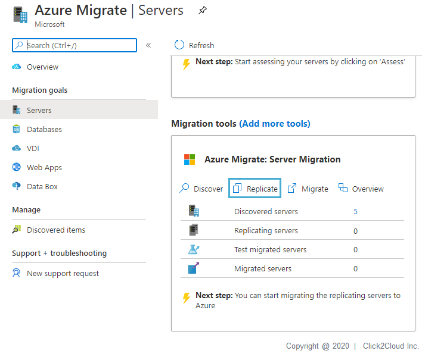
</kbd>

2. In **Replicate**, > **Source settings** > **Are your machines virtualized?**, select **Yes, with VMware vSphere**.
3. In **On-premises appliance**, select the name of the Azure Migrate appliance that you set up > **OK**.

<kbd>
  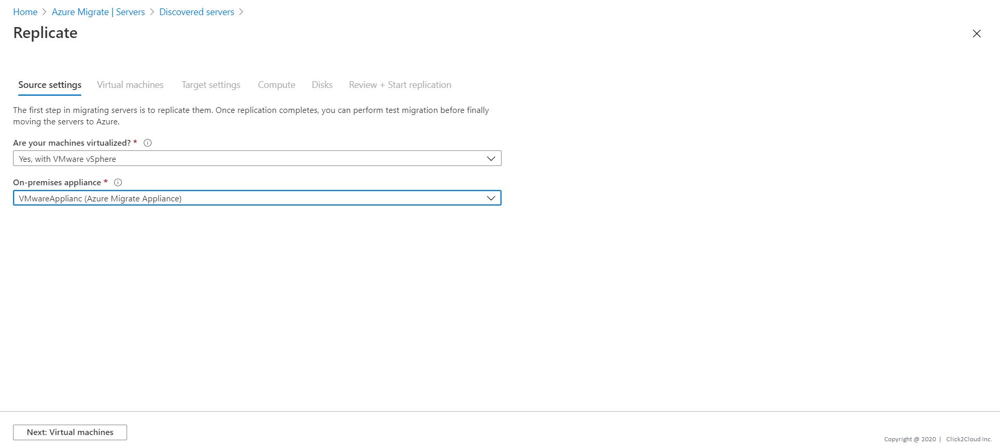
</kbd>

4. In **Virtual machines**, select the machines you want to replicate. To apply VM sizing and disk type from an assessment if you've run one, in **Import migration settings from an Azure Migrate assessment?**, select **Yes**, and select the VM group and assessment name. If you aren't using assessment settings, select **No**.

5. In **Virtual machines**, select VMs you want to migrate. Then click **Next: Target settings**.

<kbd>
  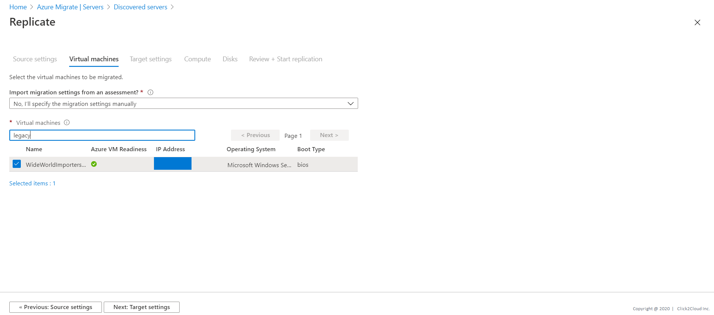
</kbd>

6. In **Target settings**, select the subscription and target region. Specify the resource group in which the Azure VMs reside after migration.

7. In **Virtual Network**, select the Azure VNet/subnet which the Azure VMs join after migration.

8. In **Azure Hybrid Benefit**:
- Select **No** if you don't want to apply Azure Hybrid Benefit. Then click **Next**.
- Select **Yes** if you have Windows Server machines that are covered with active Software Assurance or Windows Server subscriptions, and you want to apply the benefit to the machines you're migrating. Then click **Next**.

<kbd>
  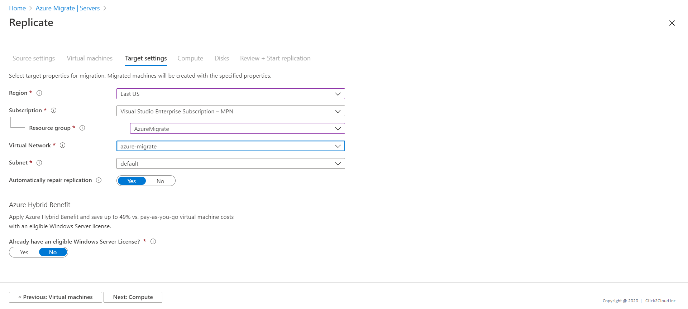
</kbd>

9. In **Compute**, review the VM name, size, OS disk type, and availability set. VMs must conform with Azure requirements.
- **VM size**: If you're using assessment recommendations, the VM size dropdown shows the recommended size. Otherwise Azure Migrate picks a size based on the closest match in the Azure subscription. Alternatively, pick a manual size in Azure VM size.
- **OS disk**: Specify the OS (boot) disk for the VM. The OS disk is the disk that has the operating system bootloader and installer.
- **Availability set**: If the VM will reside in an Azure availability set after migration, specify the set. The set must be in the target resource group you specify for the migration.

<kbd>
  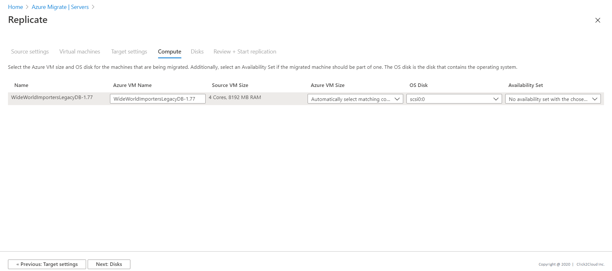
</kbd>

10. In **Disks**, specify whether the VM disks should be replicated to Azure, and select the disk type (standard SSD/HDD or premium-managed disks) in Azure. Then click **Next**.

<kbd>
  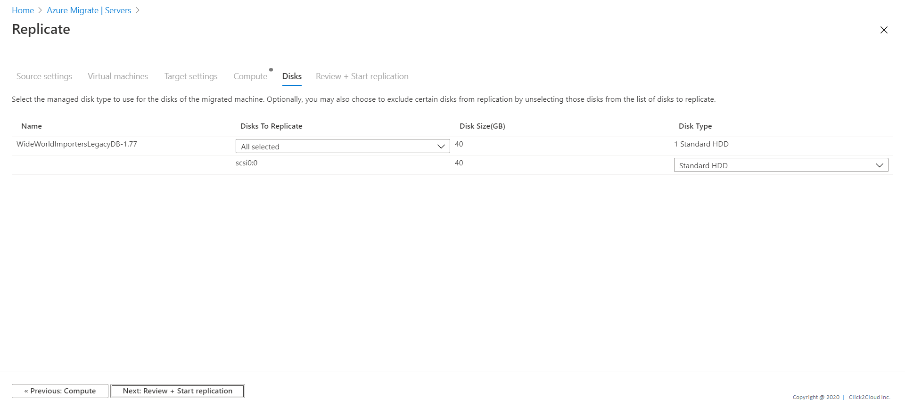
</kbd>

11. In **Review and start replication**, review the settings, and click **Replicate** to start the initial replication for the servers.

<kbd>
  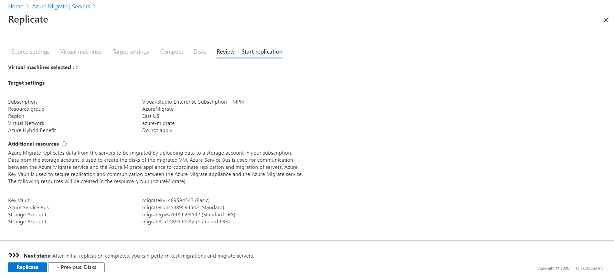
</kbd>

## Track and Monitor

1. Track job status in the portal notifications.
2. Monitor replication status by clicking on **Replicating servers** in **Azure Migrate: Server Migration**.

<kbd>
  
</kbd>

3. Replication occurs as follows:
- When the Start Replication job finishes successfully, the machines begin their initial replication to Azure.
- During initial replication, a VM snapshot is created. Disk data from the snapshot is replicated to replica managed disks in Azure.
- After initial replication finishes, delta replication begins. Incremental changes to on-premises disks are periodically replicated to the replica disks in Azure.

## Run a test migration

When delta replication begins, you can run a test migration for the VMs, before running a full migration to Azure.
- Running a test migration checks that migration will work as expected, without impacting the on-premises machines, which remain operational, and continue replicating.
- Test migration simulates the migration by creating an Azure VM using replicated data (usually migrating to a non-production VNet in your Azure subscription).
- You can use the replicated test Azure VM to validate the migration, perform app testing, and address any issues before full migration.

Do a test migration as follows:
1. After the replication job finishes, click on **Test migration**.

<kbd>
  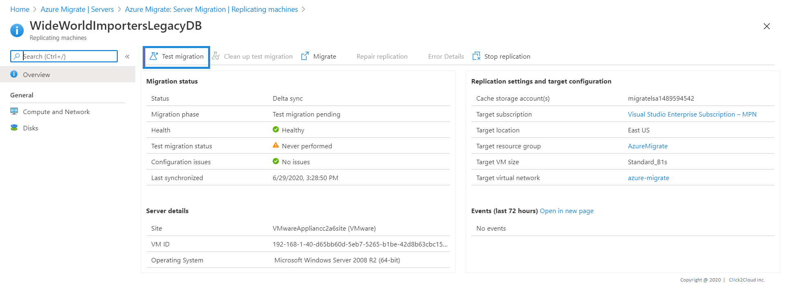
</kbd>

2. In Test Migration, select the Azure VNet in which the Azure VM will be located after the migration.

<kbd>
  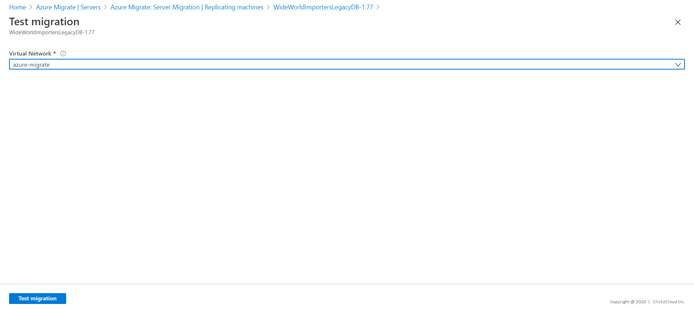
</kbd>

3. The Test migration job starts. Monitor the job in the portal notifications.
4. After the migration finishes, view the migrated Azure VM in Virtual Machines in the Azure portal. The machine name has a suffix -Test.
5. After the test is done, right-click the Azure VM in Replicating machines, and click Clean up test migration.

<kbd>
  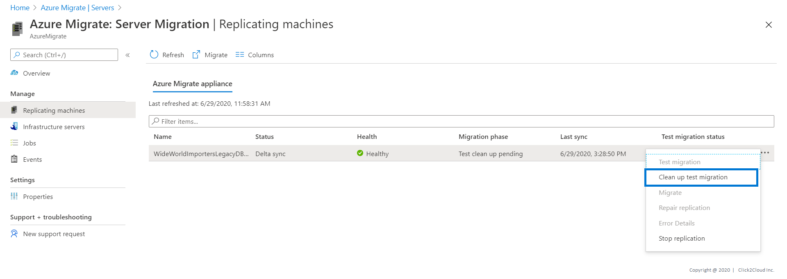
</kbd>

## Migrate VMs
After you've verified that the test migration works as expected, you can migrate the on-premises machines.

1. In the Azure Migrate project > **Servers** > **Azure Migrate: Server Migration**, click **Replicating servers**.

<kbd>
  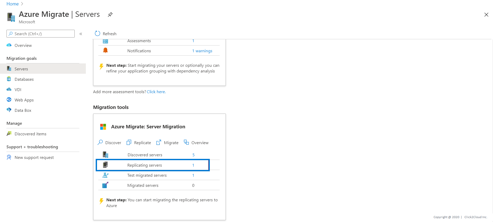
</kbd>

2. In **Replicating machines**, right-click the VM > **Migrate**.
3. In **Migrate** > **Shut down virtual machines and perform a planned migration with no data loss**, select **Yes** > **OK**.
- By default Azure Migrate shuts down the on-premises VM, and runs an on-demand replication to synchronize any VM changes that occurred since the last replication occurred. This ensures no data loss.
- If you don't want to shut down the VM, select **No**

<kbd>
  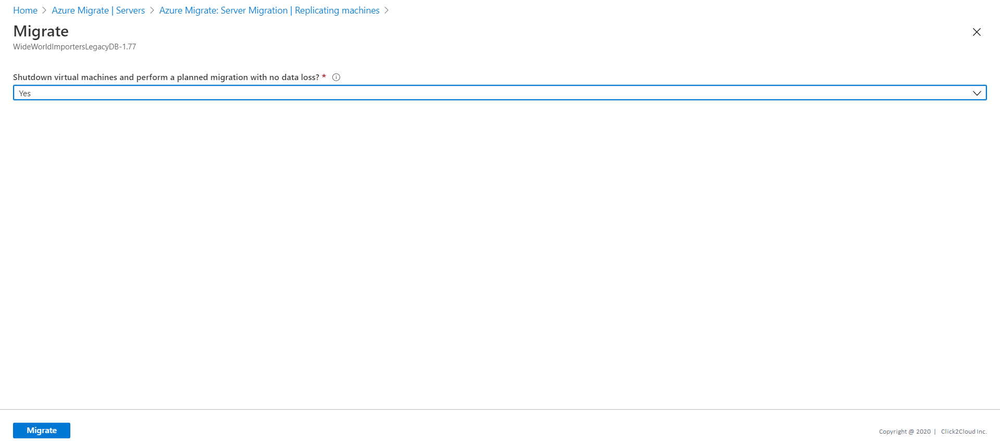
</kbd>

4. A migration job starts for the VM. Track the job in Azure notifications.
5. After the job finishes, you can view and manage the VM from the **Virtual Machines** page.

## Complete the migration
1. After the migration is done, right-click the VM > **Stop Replication**. This stops replication for the on-premises machine, and cleans up replication state information for the VM.

<kbd>
  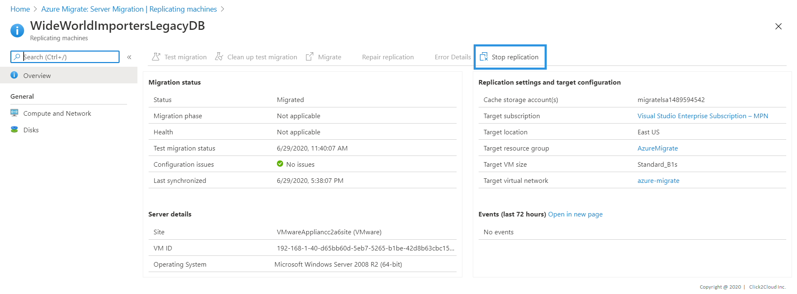
</kbd>

2. Perform any post-migration app tweaks, such as updating database connection strings, and web server configurations.
3. Perform final application and migration acceptance testing on the migrated application now running in Azure.
4. Cut over traffic to the migrated Azure VM instance.
5. Remove the on-premises VMs from your local VM inventory.
6. Remove the on-premises VMs from local backups.
7. Update any internal documentation to show the new location and IP address of the Azure VMs.