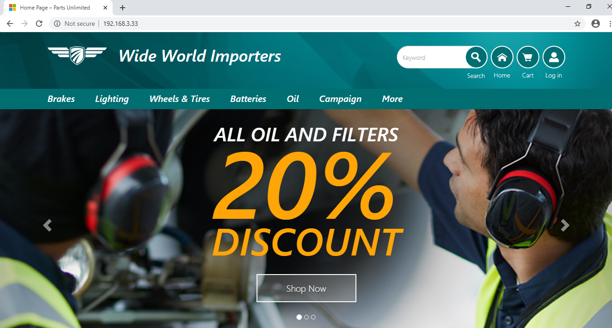
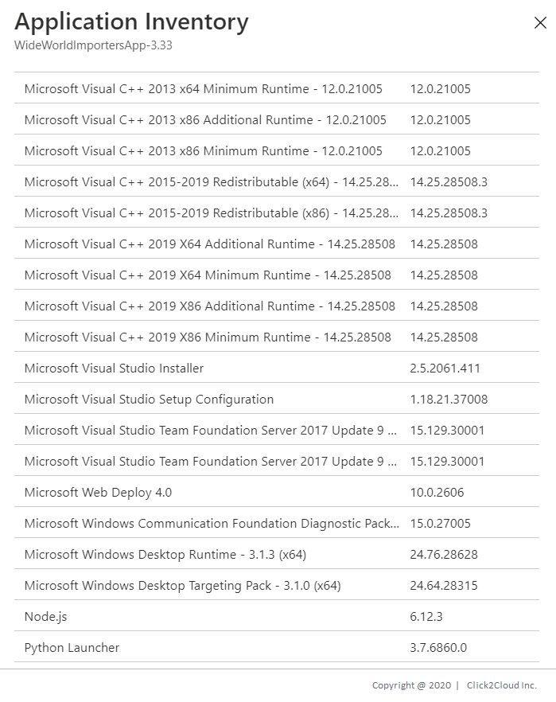
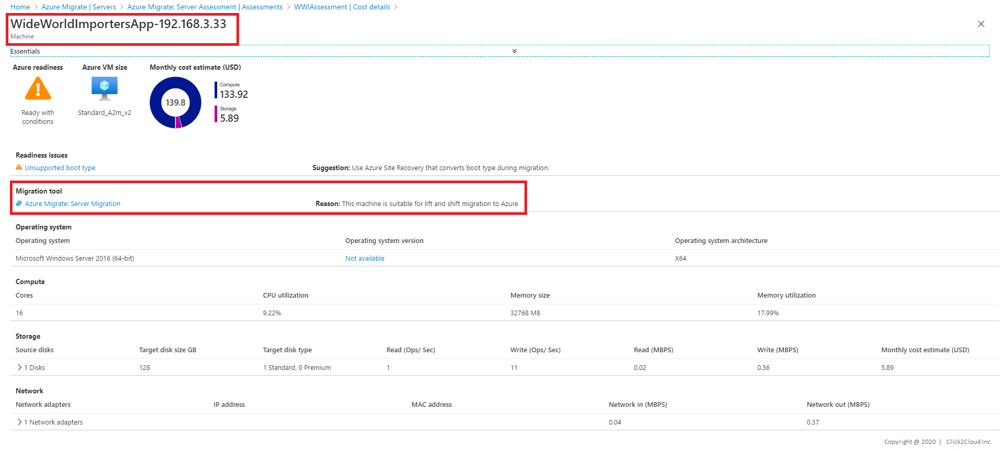
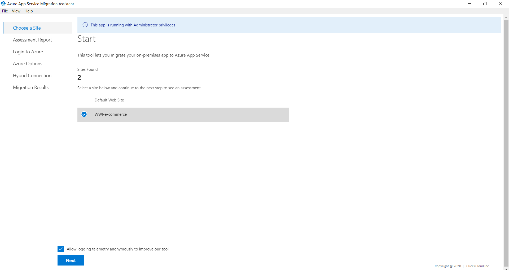

# Wide World Importers Application Assessment
* WWI has its own e-Commerce Platform where they sell WWI Brand Merchandise
* This WWI infrastructure is on on-premise
* WWI wants to migrate their workload on Azure cloud.

The application that will be migrated is hosted on a Windows server 2016 running Internet Information Services (IIS)

<kbd>
  
</kbd>

Technologies used:
 - .NET Core v2.2.104

## Steps for Application Discovery

App discovery using Azure Migrate: Server Assessment is agentless. Nothing is installed on machines and VMs. Server Assessment uses the Azure Migrate appliance to perform discovery along with machine guest credentials. The appliance remotely accesses the VMware machines using VMware APIs.

1. Log in to the azure console, Search for **Azure Migrate** and click on **Azure Migrate**.

<kbd>
  
</kbd>

2. Using Azure Migrate you can Migrate your on-premise datacenter to Azure. Click on **Servers** tab for server Assessment and Migration.

<kbd>
  
</kbd>

3. For Assessment In the **Servers** tab, in **Azure Migrate: Server Assessment** tile, click **Discovered servers**.

Here you can see all the discovered servers from your on-premise data center **vCenter** which Azure appliance has discovered.

<kbd>
  
</kbd>

<kbd>
  
</kbd>

4. In **Applications discovered**, click the displayed count.
* In **Application inventory**, you can review the discovered apps, roles, and features.

* Application Discovery for Wide World Importers Application VM.

<kbd>
  
</kbd>

## Steps for Application Dependency and Grouping

1. In the **Dependencies** column, click **View dependencies** for each machine you want to review.
2. After you've identified the dependent machines on the dependency map that you want to group together, use Ctrl+Click to select multiple machines on the map, and click Group machines.

* Application dependency for Windows VM (Application hosted on IIS - WWI-eCommerce)

<kbd>
  
</kbd>

## Steps for Azure Readiness and Total Cost of Ownership

1. In the **Servers** tab, in **Azure Migrate: Server Assessment** tile, click **Assess**.

<kbd>
  
</kbd>

2. In **Assess servers**, select the assessment type as **Azure VM**, select the discovery source and specify the assessment name.

<kbd>
  
</kbd>

3. Select **View all**, and then review the assessment properties and click **Save**.

<kbd>
  
</kbd>

4. Click next to Select machines to assess. In **Select or create a group**, select **Use Existing**, and select a group created above. Click **Next** to review the assessment details.

<kbd>
  
</kbd>

5. Select **Create Assessment** to run the assessment.

<kbd>
  
</kbd>

6. After the assessment is created, view it in **Servers** > **Azure Migrate: Server Assessment** > **Assessments**.

<kbd>
  
</kbd>

7. You will be redirected to **Assessment Overview**. Here we are using Demo specific Server and Data, so cost may differ for you.

<kbd>
  
</kbd>

8. Click on **Azure Readiness**.
Azure readiness show whether VMs are suitable for migration to Azure.

<kbd>
  
</kbd>

9. Click on **Cost Details**.
It shows the estimated monthly compute and storage costs for running the VMs in Azure and Estimated costs for disk storage after migration.

<kbd>
  
</kbd>

10. Click on Servers it will show you Migration tool suggestion and Reason why to use suggested tool.

<kbd>
  
</kbd>

## Steps for Application Assessment using Azure App Service Migration Assistant

The App Service Migration Assistant is designed to simplify your journey to the cloud through a free, simple, and fast solution to migrate .Net applications from on-premises to the cloud.

1. [Download](https://appmigration.microsoft.com/readiness) and open the Azure App Service Migration Assistant. Select the app for assessment and start the assessment.

<kbd>
  
</kbd>

2. Select the Wide World Importers site and click Next, the site will be assessed for compatibility with Azure App Services.

<kbd>
  
</kbd>

> Congratulations ! You are now ready with your Application Assessment, Please move for the [Migration](../migrate/wwi-ecomm-app.md) of same.