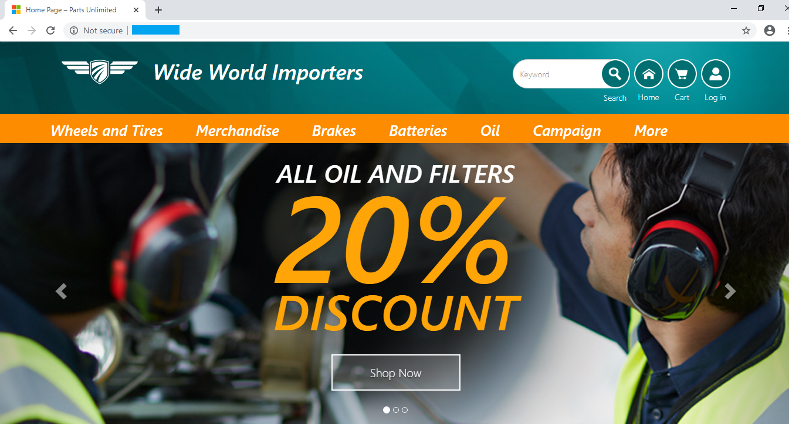
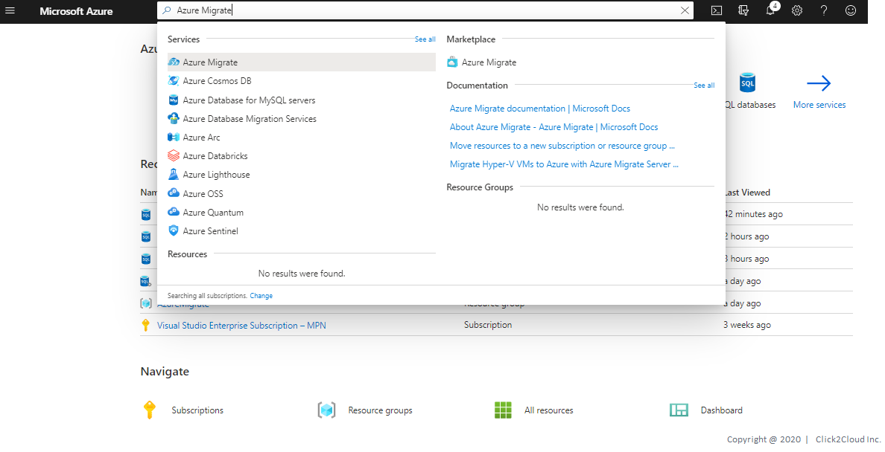
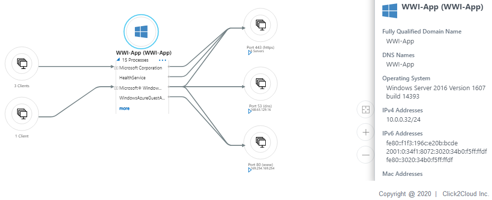
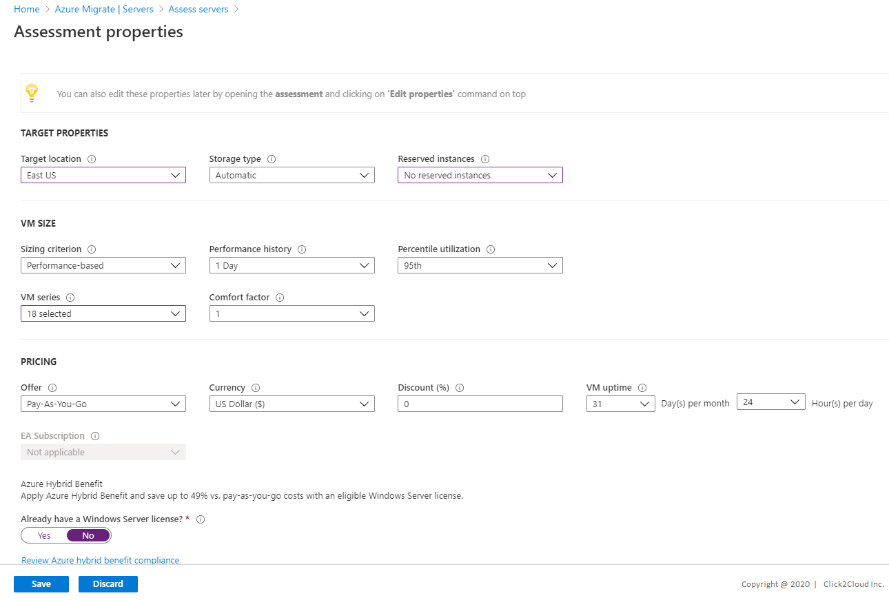
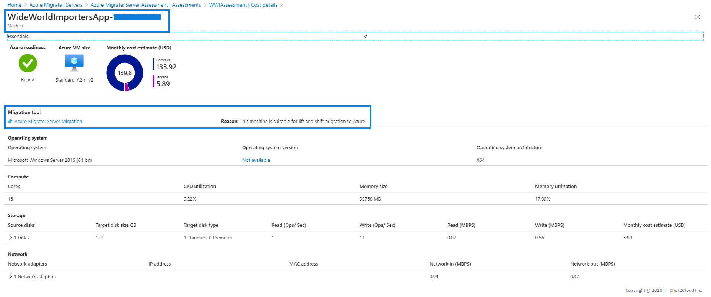
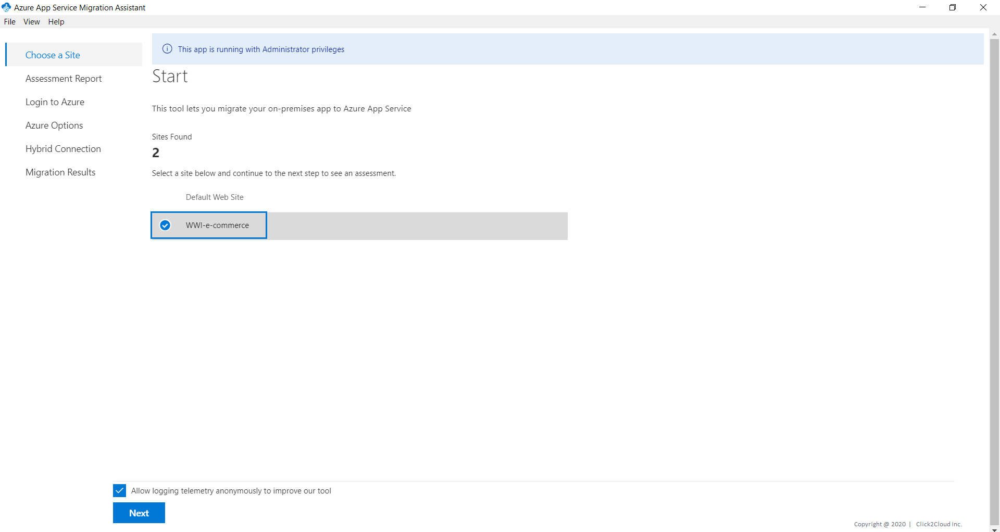
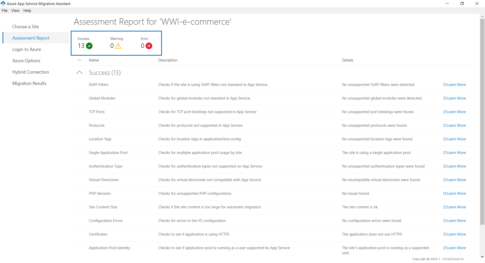

# Wide World Importers Application Assessment
* WWI has its own e-Commerce Platform where they sell WWI Brand Merchandise.
* This WWI is on on-premise infrastructure.
* WWI wants to migrate their workload on Azure cloud.

The application that will be migrated is hosted on a Windows server 2016 running Internet Information Services (IIS)

<kbd>
  
</kbd>

Technologies used:
 - .NET Core v2.2.104

## Steps for Application Dependency and Grouping

Dependency mapping helps you to visualize dependencies across machines. You typically use dependency mapping when you want to assess machine groups with higher levels of confidence.
- It helps you to cross-check machine dependencies, before you run an assessment.
- It also helps to effectively plan your migration to Azure, by ensuring that nothing is left behind, and thus avoiding surprise outages during migration.
- You can discover interdependent systems that need to migrate together, and identify whether a running system is still serving users, or is a candidate for decommissioning instead of migration.

### Agent-Based Dependency Visualization

> Steps for installing dependency agent on VMs can be found [here](https://docs.microsoft.com/en-us/azure/migrate/how-to-create-group-machine-dependencies)

1. Log in to the azure console, Search for **Azure Migrate** and click on **Azure Migrate**.

<kbd>
  
</kbd>

2. Using Azure Migrate you can Migrate your on-premise datacenter to Azure. Click on **Servers** tab for server Assessment and Migration.

<kbd>
  
</kbd>

3. For Assessment In the **Servers** tab, in **Azure Migrate: Server Assessment** tile, click **Discovered servers**.

Here you can see all the discovered servers which Azure appliance has discovered.

<kbd>
  
</kbd>

<kbd>
  
</kbd>

1. In the **Dependencies** column, click **View dependencies** for each machine you want to review.
2. After you have identified the dependent machines on the dependency map that you want to group together, use Ctrl+Click to select multiple machines on the map, and click Group machines.

* Application dependency for Windows VM (Application hosted on IIS - WWI e-Commerce)

<kbd>
  
</kbd>

## Steps for Azure Readiness and Total Cost of Ownership

1. In the **Servers** tab, in **Azure Migrate: Server Assessment** tile, click **Assess**.

<kbd>
  
</kbd>

2. In **Assess servers**, select the assessment type as **Azure VM**, select the discovery source and specify the assessment name.

<kbd>
  
</kbd>

3. Select **View all**, and then review the assessment properties and click **Save**.

<kbd>
  
</kbd>

4. Click next to Select machines to assess. In **Select or create a group**, select **Use Existing**, and select a group created above. Click **Next** to review the assessment details.

<kbd>
  
</kbd>

5. Select **Create Assessment** to run the assessment.

<kbd>
  
</kbd>

6. After the assessment is created, view it in **Servers** > **Azure Migrate: Server Assessment** > **Assessments**.  

    Each performance-based Azure VM assessment in Azure Migrate is associated with a confidence rating. The rating ranges from one (lowest) to five (highest) stars. The confidence rating helps you to estimate the reliability of the size recommendations Azure Migrate provides. Azure migrate recommends to performs assessment after 24 hours of discovery to get accurate and reliable assessment results.

    - The confidence rating is assigned to an assessment. The rating is based on the availability of data points that are needed to compute the assessment.
    - For performance-based sizing, Server Assessment needs:
      * The utilization data for CPU and VM RAM.
      * The disk IOPS and throughput data for every disk attached to the VM.
      * The network I/O to handle performance-based sizing for each network adapter attached to a VM.  

<kbd>
  
</kbd>

7. You will be redirected to **Assessment Overview**. Here we are using Demo specific Server and Data, so cost may differ for you.

<kbd>
  
</kbd>

8. Click on **Azure Readiness**.
Azure readiness show whether VMs are suitable for migration to Azure.

<kbd>
  
</kbd>

9. Click on **Cost Details**.
It shows the estimated monthly compute and storage costs for running the VMs in Azure and Estimated costs for disk storage after migration.

<kbd>
  
</kbd>

10. Click on Servers it will show you Migration tool suggestion and Reason why to use suggested tool.

<kbd>
  
</kbd>

## Steps for Application Assessment using Azure App Service Migration Assistant

The App Service Migration Assistant is designed to simplify your journey to the cloud through a free, simple, and fast solution to migrate .Net applications from on-premises to the cloud.

1. [Download](https://appmigration.microsoft.com/readiness) and open the Azure App Service Migration Assistant. Select the app for assessment and start the assessment.

<kbd>
  
</kbd>

2. Select the Wide World Importers site and click Next, the site will be assessed for compatibility with Azure App Services.

<kbd>
  
</kbd>

> Congratulations! You are now ready with your Application Assessment. Please move for the [Migration](../migrate/wwi-ecomm-app.md) of same.
