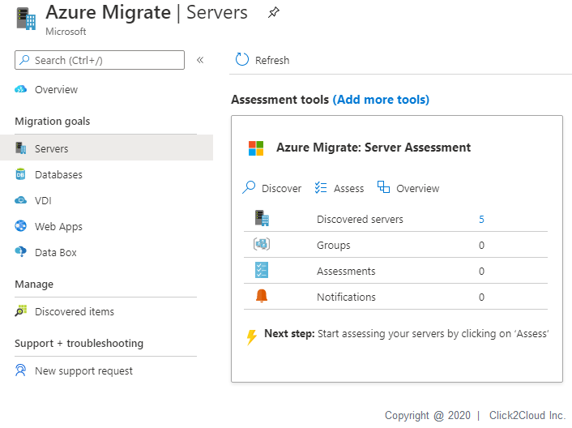
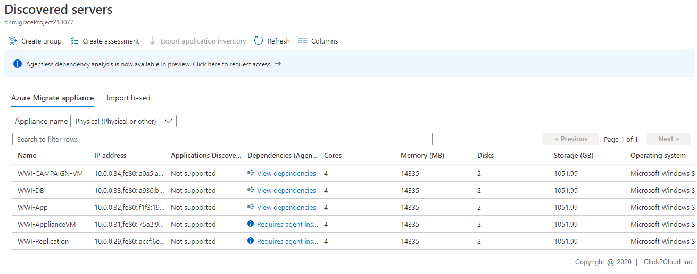
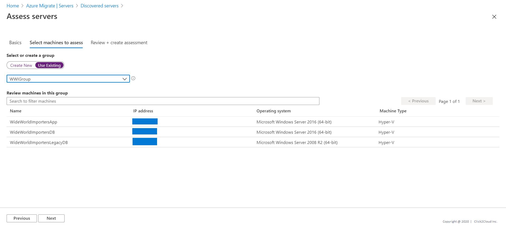
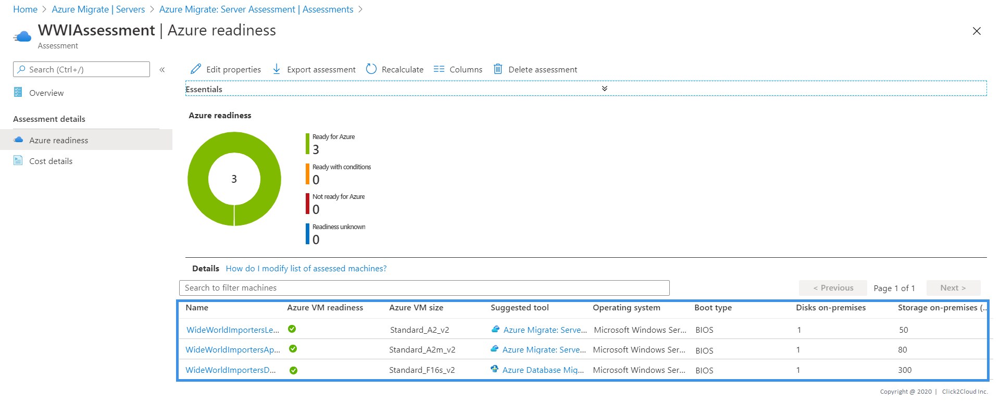
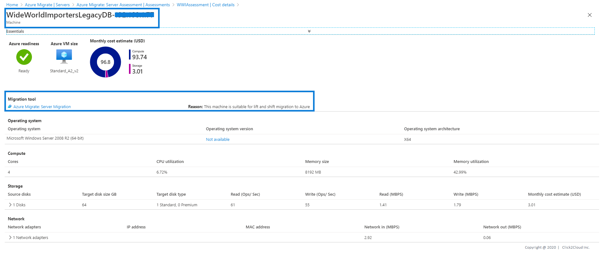

# Wide World Importers legacy Database Assessment
* WWI has its own e-Commerce Platform where they sell WWI Brand Merchandise.
* This WWI is on on-premise infrastructure.
* WWI wants to migrate their workload on Azure cloud.

The database that will be migrated contains campaign related data and is hosted on Windows 7.

Technologies used:
 - Microsoft SQL Server 2005

## Steps for Application Discovery

App discovery using Azure Migrate: Server Assessment is agentless. Nothing is installed on machines and VMs. Server Assessment uses the Azure Migrate appliance to perform discovery along with machine guest credentials. The appliance remotely accesses the VMware machines using VMware APIs.

1. Log in to the azure console, Search for **Azure Migrate** and click on **Azure Migrate**.

<kbd>
  
</kbd>

2. Using Azure Migrate you can Migrate your on-premise datacenter to Azure. Click on **Servers** tab for server Assessment and Migration.

<kbd>
  
</kbd>

3. For Assessment In the **Servers** tab, in **Azure Migrate: Server Assessment** tile, click **Discovered servers**.

Here you can see all the discovered servers from your on-premise data center **vCenter** which Azure appliance has discovered.

<kbd>
  
</kbd>

<kbd>
  
</kbd>

4. In **Applications discovered**, click the displayed count.
* In **Application inventory**, you can review the discovered apps, roles, and features.

* Application Discovery for Wide World Importers legacy Database VM.

<kbd>
  
</kbd>

## Steps for Azure Readiness and Total Cost of Ownership

1. In the **Servers** tab, in **Azure Migrate: Server Assessment** tile, click **Assess**.

<kbd>
  
</kbd>

2. In **Assess servers**, select the assessment type as **Azure VM**, select the discovery source and specify the assessment name.

<kbd>
  
</kbd>

3. Select **View all**, and then review the assessment properties and click **Save**.

<kbd>
  
</kbd>

4. Click next to Select machines to assess. In **Select or create a group**, select **Use Existing**, and select a group created above. Click **Next** to review the assessment details.

<kbd>
  
</kbd>

5. Select **Create Assessment** to run the assessment.

<kbd>
  
</kbd>

6. After the assessment is created, view it in **Servers** > **Azure Migrate: Server Assessment** > **Assessments**.  

    Each performance-based Azure VM assessment in Azure Migrate is associated with a confidence rating. The rating ranges from one (lowest) to five (highest) stars. The confidence rating helps you to estimate the reliability of the size recommendations Azure Migrate provides. Azure migrate recommends to perform assessment after 24 hours of discovery to get accurate and reliable assessment results.

    - The confidence rating is assigned to an assessment. The rating is based on the availability of data points that are needed to compute the assessment.
    - For performance-based sizing, Server Assessment needs:
      * The utilization data for CPU and VM RAM.
      * The disk IOPS and throughput data for every disk attached to the VM.
      * The network I/O to handle performance-based sizing for each network adapter attached to a VM.  

<kbd>
  
</kbd>

7. You will be redirected to **Assessment Overview**. Here we are using Demo specific Server and Data, so cost may differ for you.

<kbd>
  
</kbd>

8. Click on **Azure Readiness**.
Azure readiness show whether VMs are suitable for migration to Azure.

<kbd>
  
</kbd>

9. Click on **Cost Details**.
It shows the estimated monthly compute and storage costs for running the VMs in Azure and Estimated costs for disk storage after migration.

<kbd>
  
</kbd>

10. Click on Servers it will show you Migration tool suggestion and Reason why to use suggested tool.

<kbd>
  
</kbd>

> Congratulations! You are now ready with your Database Assessment. Please move for the [Migration](../migrate/wwi-ecomm-db-legacy.md) of the same.
