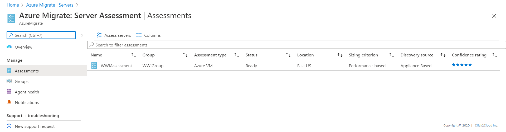
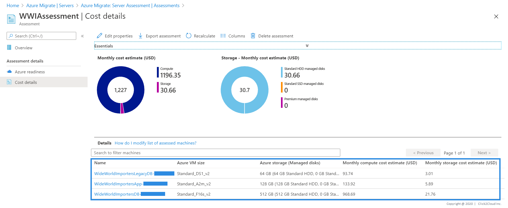

# Wide World Importers legacy Database Assessment
* WWI has its own e-Commerce Platform where they sell WWI Brand Merchandise
* This WWI infrastructure is on on-premise
* WWI wants to migrate their workload on Azure cloud.

The database that will be migrated is hosted on a Windows 7.

Technologies used:
 - Microsoft SQL Server 2005

## Steps for Application Discovery

App discovery using Azure Migrate: Server Assessment is agentless. Nothing is installed on machines and VMs. Server Assessment uses the Azure Migrate appliance to perform discovery along with machine guest credentials. The appliance remotely accesses the VMware machines using VMware APIs.

1. Log in to the azure console, Search for **Azure Migrate** and click on **Azure Migrate**.

<kbd>
  
</kbd>

2. Using Azure Migrate you can Migrate your on-premise datacenter to Azure. Click on **Servers** tab for server Assessment and Migration.

<kbd>
  
</kbd>

3. For Assessment In the **Servers** tab, in **Azure Migrate: Server Assessment** tile, click **Discovered servers**.

Here you can see all the discovered servers from your on-premise data center **vCenter** which Azure appliance has discovered.

<kbd>
  
</kbd>

<kbd>
  
</kbd>

4. In **Applications discovered**, click the displayed count.
* In **Application inventory**, you can review the discovered apps, roles, and features.

* Application Discovery for Wide World Importers legacy Database VM.

<kbd>
  
</kbd>

## Steps for Azure Readiness and Total Cost of Ownership

1. In the **Servers** tab, in **Azure Migrate: Server Assessment** tile, click **Assess servers**.

<kbd>
  
</kbd>

2. In **Assess servers**, specify a name for the assessment. In **Select or create a group**, select **Use Existing**, and select a group created above. Click on **Create Assessment**.

<kbd>
  
</kbd>

3. After the assessment is created, view it in **Servers** > **Azure Migrate: Server Assessment** > **Assessments**.

<kbd>
  
</kbd>

4. You will be redirected to **Assessment Overview**. Here we are using Demo specific Server and Data, so cost may differ for you.

<kbd>
  
</kbd>

5. Click on **Azure Readiness**.
Azure readiness show whether VMs are suitable for migration to Azure.

<kbd>
  
</kbd>

6. Click on **Cost Details**.
It shows the estimated monthly compute and storage costs for running the VMs in Azure and Estimated costs for disk storage after migration.

<kbd>
  
</kbd>

7. Click on Servers it will show you Migration tool suggestion and Reason why to use suggested tool.

<kbd>
  
</kbd>
