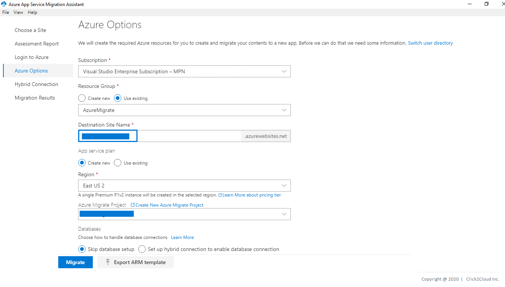
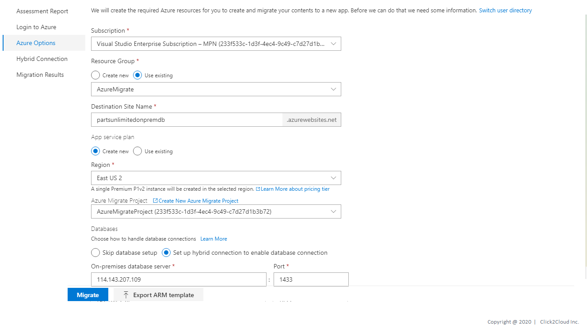
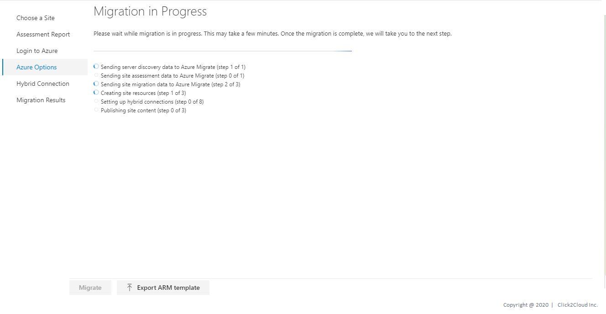
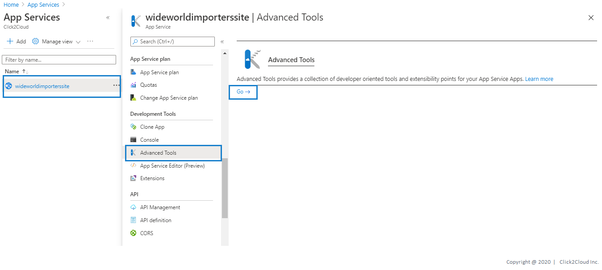
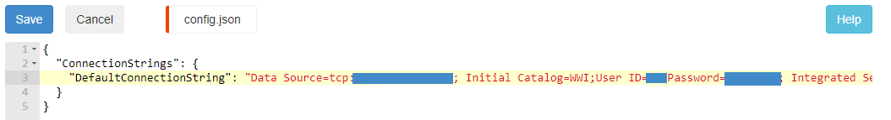
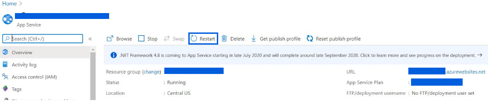

# Wide World Importers Application Migration
* WWI has its own e-Commerce Platform where they sell WWI Brand Merchandise.
* This WWI is on on-premise infrastructure.
* WWI wants to migrate their workload on Azure cloud.

The application that will be migrated is hosted on a Windows server 2016 running Internet Information Services (IIS)

<kbd>
  
</kbd>

Technologies used:
 - .NET Core v2.2.104

## Steps for Application Migration using Azure App Service Migration Assistant

We are assuming that you have migrated your on-premise SQL database to Azure SQL database and ready to migrate your on-premise web application to azure cloud.

> Still not migrated on-premise SQL database ? Click to [Assess](../assess/wwi-ecomm-db.md) and [Migrate](../migrate/wwi-ecomm-db.md).

1. Before you start the migration process, you need to login to Azure account with a subscription. Click on **Copy Code & Open Browser**.

<kbd>
  
</kbd>

<kbd>
  
</kbd>

2. Azure will create the required Azure resources for you to create and migrate your contents to a new app. Before we can do that we need some information. Please fill all the information and Click on **Migrate**.

<kbd>
  
</kbd>

3. Please wait while migration is in progress. This may take few minutes. Once the migration is complete, we will take you to the next step.

<kbd>
  
</kbd>

4. Your site has been successfully migrated! Click on **Go to your website**.

<kbd>
  
</kbd>

Please change from on-premise SQL database connection string to migrated Azure SQL database connection string in **config.json** file of your application as follows.

* Login to azure portal and search for **App Services**, Click on **App Services** and Select web app name which you have migrated in previous step.

* Click on **Advance Tools** and then click on **GO**.

* Kudo will Open.
> Kudu is the engine behind git deployments in Azure Web Sites. It can also run outside of Azure.

<kbd>
  
</kbd>

* For viewing folder structure of published web app click on **Debug Console** and select **CMD**.

<kbd>
  
</kbd>

* Go to the path where your config file is present.

<kbd>
  
</kbd>

* On-premise SQL database connection string

<kbd>
  
</kbd>

* Update Azure SQL database connection string and Click on **Save**.

<kbd>
  
</kbd>

* Then go to your **Resource Group** where Web App is migrated.
* Click on **Web App** and **Restart** the service.

<kbd>
  
</kbd>

* We have updated the connection string also restarted the **Web App service**, now please go to your domain and check application is running on it.

<kbd>
  
</kbd>

> Congratulations! You are now ready with your Application on Azure Cloud. 

