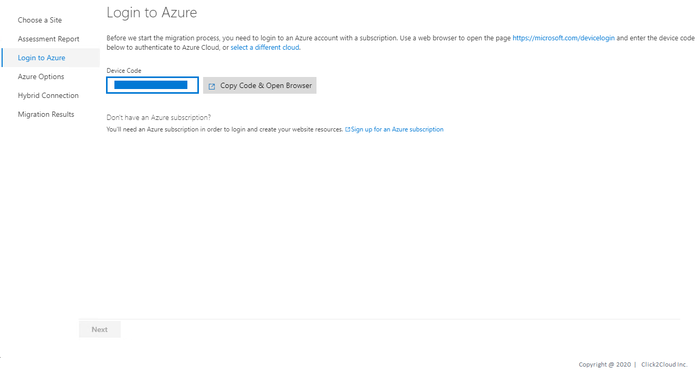
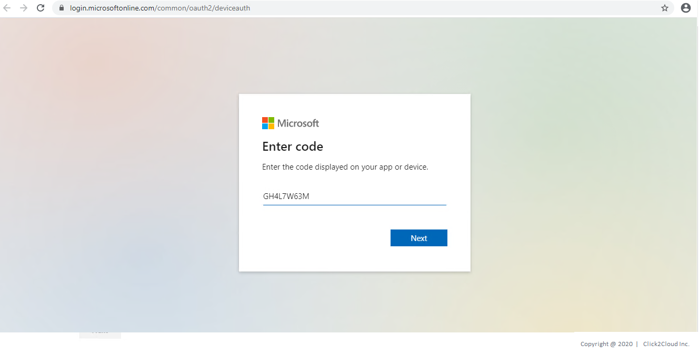
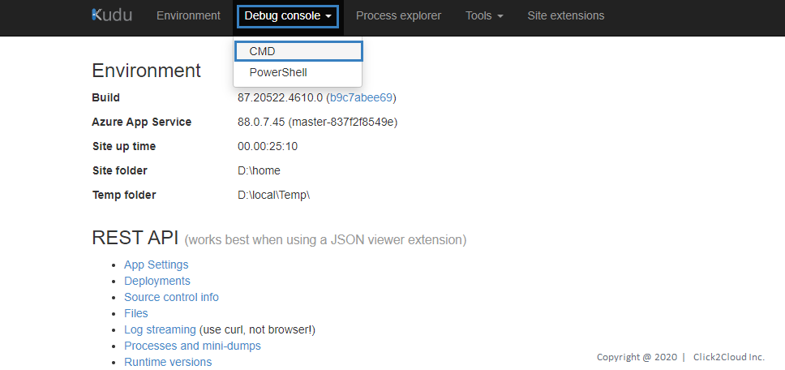
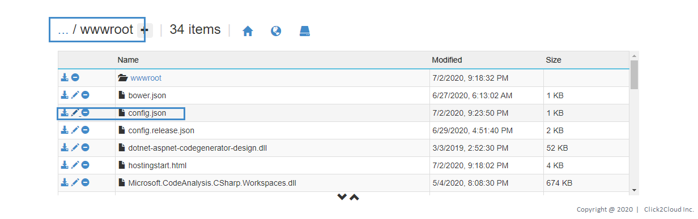
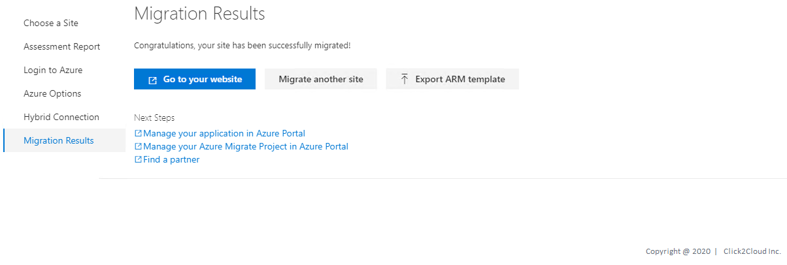

# Wide World Importers Application Migration
* WWI has its own e-Commerce Platform where they sell WWI Brand Merchandise
* This WWI infrastructure is on on-premise
* WWI wants to migrate their workload on Azure cloud.

The application that will be migrated is hosted on a Windows server 2016 running Internet Information Services (IIS)

Technologies used:
 - .NET Core v2.2.104

## Steps for Application Migration using Azure App Service Migration Assistant

1. Before you start the migration process, you need to login to Azure account with a subscription. Click on **Copy Code & Open Browser**

<kbd>
  
</kbd>

<kbd>
  
</kbd>

2. Azure will create the required Azure resources for you to create and migrate your contents to a new app. Before we can do that we need some information. Please fill all the information and Click on **Migrate**.

<kbd>
  
</kbd>

3. Please wait while migration is in progress. This may take few minutes. Once the migration is Complete, we will take you to the next step.

<kbd>
  
</kbd>

4. Congratulations, your site has been successfully migrated! Click on **Go to your website**

<kbd>
  
</kbd>
