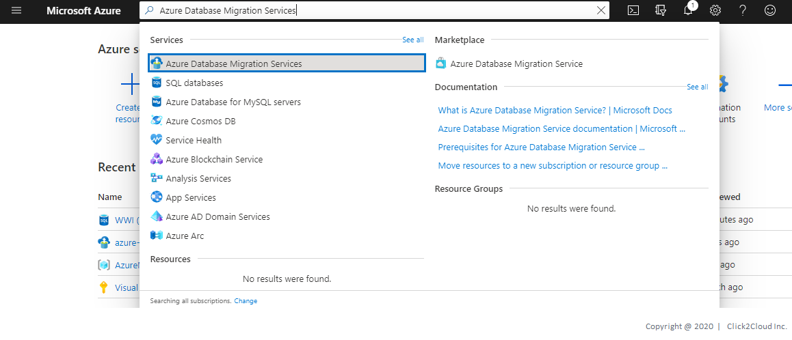

# Wide World Importers Database Migration
* WWI has its own e-Commerce Platform where they sell WWI Brand Merchandise.
* This WWI is on on-premise infrastructure.
* WWI wants to migrate their workload on Azure cloud.

The database that will be migrated is hosted on a Windows server 2016.

Technologies used:
 - Microsoft SQL Server 2017

## Steps for Data Migration using **Azure Database Migration Service.** 
1. Log in to the azure console, Search for **Azure Data Migration Service** and click on **Azure Database Migration Service**.

<kbd>
   
</kbd>

2. On the Azure Database Migration Service screen, click on **Add** button to create the service if it does not exist already.

<kbd>
   
</kbd>

3. On the Create Migration Service screen, 
    * Specify a name for the service, the subscription, and a new or existing resource group.
    * Select the location in which you want to create the instance of Azure Database Migration Service.
    * Select an existing virtual network or create a new one.
    * Select a pricing tier.

> The virtual network provides Azure Database Migration Service with access to the source SQL Server and the target Azure SQL Database instance. For more information about how to create a virtual network in the Azure portal, see the article [Create a virtual network](https://docs.microsoft.com/en-us/azure/virtual-network/quick-create-portal) using the Azure portal.

<kbd>
   
</kbd>

3. After the service is created,
    * On the Azure Database Migration Services screen, select the Azure Database Migration Service that you created.
    * Select New Migration Project.

<kbd>
  
</kbd>

4. On the New migration project screen,
    * Specify a **name for the project**, 
    * In the **Source server** type text box select **SQL Server**,
    * In the **Target server** type text box select **Azure SQL Database Management Instance**, and 
    * Then for **Choose type of activity** select **online data migration** Click on **Save**.
    * Select **Create and run activity** to create the project and run the migration activity.

<kbd>
  
</kbd>

<kbd>
  
</kbd>

5. Specify source details
    * On the Migration source detail screen, specify the connection details for the source SQL Server.

    * If you have not installed a trusted certificate on your source server, select the Trust server certificate check box.

    When a trusted certificate is not installed, SQL Server generates a self-signed certificate when the instance is started. This certificate is used to encrypt the credentials for client connections.

<kbd>
  
</kbd>

8. Specify target details

  * On the Migration target details screen, specify the **Application ID** and **Key** that the DMS instance can use to connect to the target instance of **SQL Managed Instance** and the **Azure Storage Account**.

  [For more information, see the article Use portal to create an Azure Active Directory application and service principal that can access resources.](https://docs.microsoft.com/en-us/azure/active-directory/develop/howto-create-service-principal-portal)

  * Select the **Subscription** containing the target instance of SQL Managed Instance, and then **select the target instance**.

  If you haven't already provisioned the SQL Managed Instance, select the [link](https://docs.microsoft.com/en-us/azure/azure-sql/managed-instance/instance-create-quickstart) to help you provision the instance. When the SQL Managed Instance is ready, return to this specific project to execute the migration.

  * Provide **SQL User** and **Password** to connect to the SQL Managed Instance.

  * Select **Save**.

<kbd>
  
</kbd>

9. Select source databases
  * On the Select source databases screen, select the source database that you want to migrate.
  * Select **Save**.

<kbd>
  
</kbd>

10. Configure migration settings
* On the **Configure migration settings** screen, provide the following detail:

|  |  |
| --- | --- |
| `SMB Network location share` | The local SMB network share or Azure file share that contains the Full database backup files and transaction log backup files that Azure Database Migration Service can use for migration. The service account running the source SQL Server instance must have read\write privileges on this network share. Provide an FQDN or IP addresses of the server in the network share, for example, '\\servername.domainname.com\backupfolder' or '\\IP address\backupfolder'. For improved performance, it's recommended to use separate folder for each database to be migrated. You can provide the database level file share path by using the Advanced Settings option. |
| `User name` | Make sure that the Windows user has full control privilege on the network share that you provided above. Azure Database Migration Service will impersonate the user credential to upload the backup files to Azure Storage container for restore operation. If using Azure File share, use the storage account name pre-pended with AZURE\ as the username. |
| `Password` | Password for the user. If using Azure file share, use a storage account key as the password. |
| `Subscription of the Azure Storage Account` | Select the subscription that contains the Azure Storage Account. |
| `Azure Storage Account` | Select the Azure Storage Account that DMS can upload the backup files from the SMB network share to and use for database migration. We recommend selecting the Storage Account in the same region as the DMS service for optimal file upload performance. |

  * Select **Save**.

<kbd>
  
</kbd>

11. Review the migration summary

  * On the **Migration summary** screen, in the **Activity name** text box, specify a name for the **migration activity**.

  * Review and verify the details associated with the migration project.

<kbd>
  
</kbd>

12. Run and monitor the migration

  * Select **Run migration**.

  * On the **migration activity** screen, select **Refresh** to update the display.

<kbd>
  
</kbd>

* You can further expand the databases and logins categories to monitor the migration status of the respective server objects.

<kbd>
  
</kbd>

13. Performing migration cutover

After the full database backup is restored on the target instance of SQL Managed Instance, the database is available for performing a migration cutover.

  * When you're ready to complete the online database migration, select **Start Cutover**.

  * Stop all the incoming traffic to **source databases**.

  * Take the [tail-log backup], make the backup file available in the SMB network share, and then wait until this final transaction log backup is restored.

    At that point, you'll see **Pending changes** set to 0.

  * Select **Confirm**, and then select **Apply**.

<kbd>
  
</kbd>

  * When the database migration status shows **Completed**, connect your applications to the new **target instance of SQL Managed Instance**.

<kbd>
  
</kbd>

> Congratulations! You are now ready with your Database on Azure Cloud. 

