# Wide World Importers Database Migration
* WWI has its own e-Commerce Platform where they sell WWI Brand Merchandise
* This WWI infrastructure is on on-premise
* WWI wants to migrate their workload on Azure cloud.

The database that will be migrated is hosted on a Windows server 2016.

Technologies used:
 - Microsoft SQL Server 2017

## Steps for Schema migration using **Data Migration Assistant**
1. Create a migration project.
   1. On the left, select the + icon, and then select the migration **Project type**.
   2. Specify the project name, and then select the source server and target server types.
   3. Select Migration Scope as Schema only. Here we are performing migration using Azure Database Migration Service.
   4. Click on **Create**.

<kbd>
  
</kbd>

2. Enter source server details and connect to it then Select single database from your source server to migrate to Azure SQL Database and click **Next**

<kbd>
  
</kbd>

3. Enter target server details and connect to it then Select single database from your target Azure SQL Database Server and click **Next**

<kbd>
  
</kbd>

4. Wait while Preparing source database schema.

<kbd>
  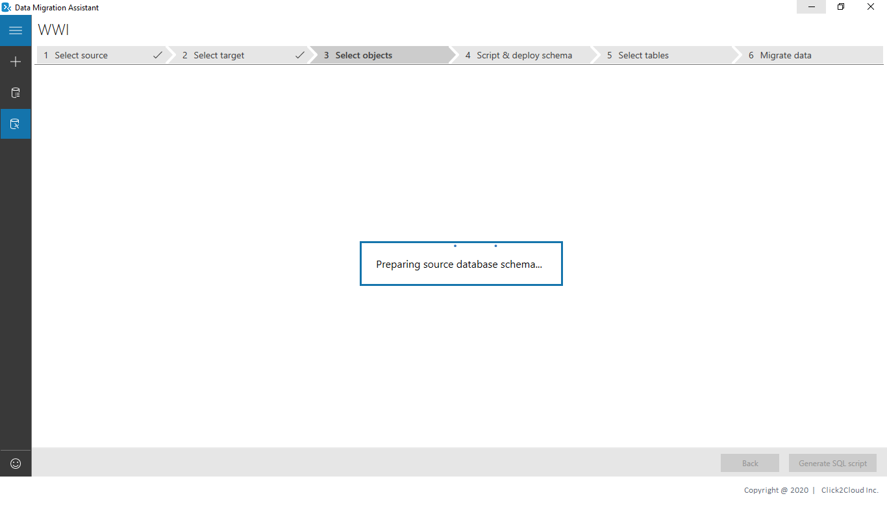
</kbd>

5. Select the schema objects from your source database that you want to migrate to Azure SQL Database.

<kbd>
  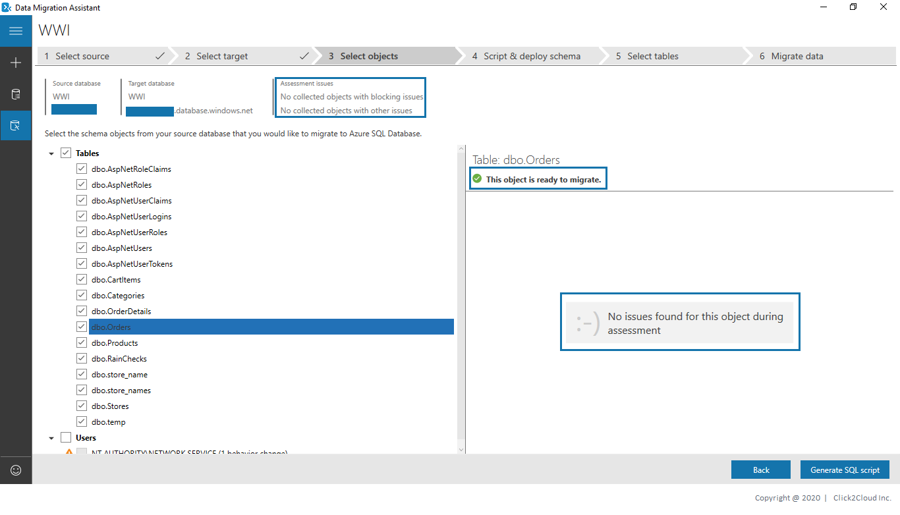
</kbd>

6. The script was generated for the selected schema objects. Review the script, make edits if necessary, and click **Deploy Schema** to deploy to Azure SQL Database.

<kbd>
  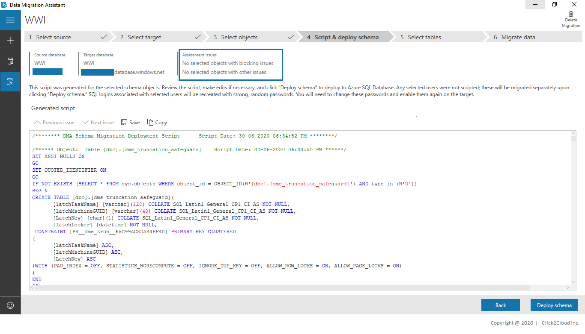
</kbd>

<kbd>
  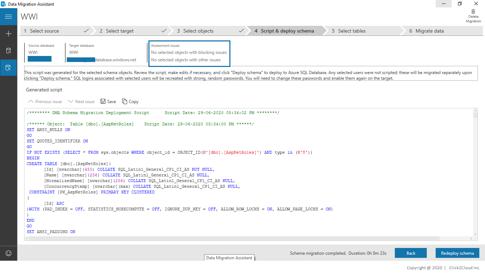
</kbd>

7. After deploying schema, you can also redeploy it by clicking **Redeploy schema**.

## Steps for Data Migration using **Azure Database Migration Service.** 
1. Log in to the azure console, Search for **Azure Data Migration Service** and click on **Azure Database Migration Service**,

<kbd>
   
</kbd>

2. On the Azure Database Migration Service screen, click on **Add** button to create the service if not exist already.

<kbd>
   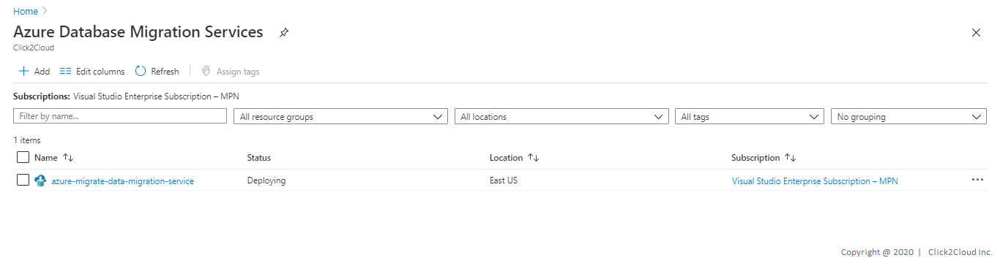
</kbd>

3. On the Create Migration Service screen, 
    * Specify a name for the service, the subscription, and a new or existing resource group.
    * Select the location in which you want to create the instance of Azure Database Migration Service.
    * Select an existing virtual network or create a new one.
    * Select a pricing tier.

> The virtual network provides Azure Database Migration Service with access to the source SQL Server and the target Azure SQL Database instance. For more information about how to create a virtual network in the Azure portal, see the article [Create a virtual network](https://docs.microsoft.com/en-us/azure/virtual-network/quick-create-portal) using the Azure portal.

<kbd>
   
</kbd>

3. After the service is created,
    * On the Azure Database Migration Services screen, select the Azure Database Migration Service that you created.
    * Select New Migration Project.

<kbd>
  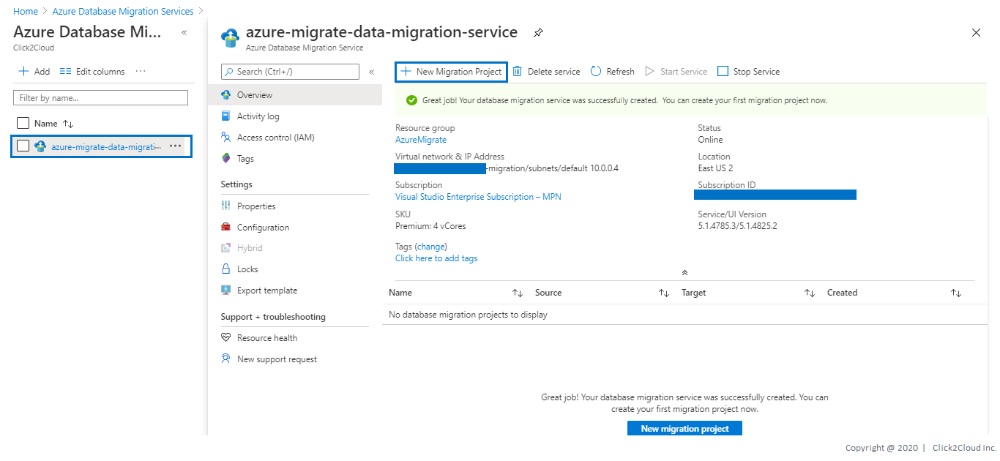
</kbd>

4. On the New migration project screen,
    * Specify a **name for the project**, 
    * In the **Source server** type text box select **SQL Server**,
    * In the **Target server** type text box select **Azure SQL Database**, and 
    * Then for **Choose type of activity** select **online data migration** Click on **Save**.
    * Select **Create and run activity** to create the project and run the migration activity.

<kbd>
  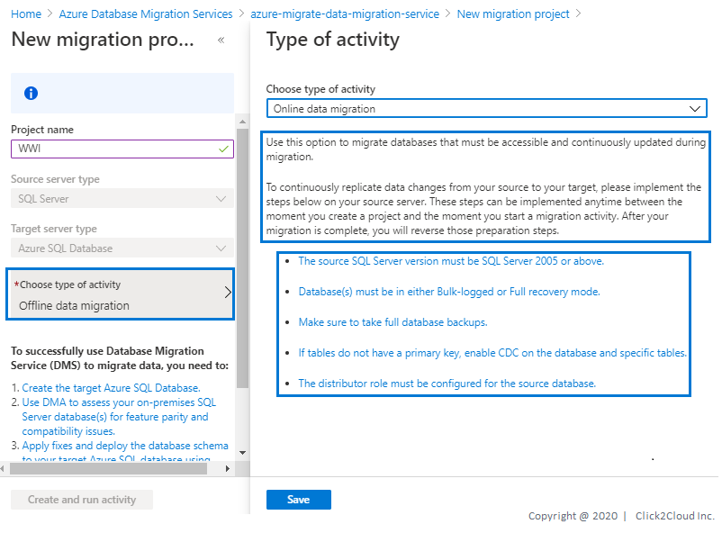
</kbd>

<kbd>
  
</kbd>

5. Specify source details
    * On the Migration source detail screen, specify the connection details for the source SQL Server instance.
    
    Make sure to use a Fully Qualified Domain Name (FQDN) for the source SQL Server instance name. You can also use the IP Address for situations in which DNS name resolution isn't possible.

    * If you have not installed a trusted certificate on your source server, select the Trust server certificate check box.

    When a trusted certificate is not installed, SQL Server generates a self-signed certificate when the instance is started. This certificate is used to encrypt the credentials for client connections.

<kbd>
  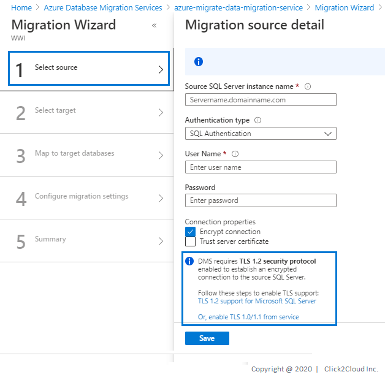
</kbd>

8. Specify the connection details for the target **Azure SQL Database**, which is the pre-provisioned **Azure SQL Database** to which the **WWI** schema was deployed by using the **Data Migration Assistant** and click on **Save** to see summary, then click on **Save**.

<kbd>
  
</kbd>

9. On **Map to target databases** screen, map the **source** and the **target** database for migration. Click on **Save**.

    If the target database contains the same database name as the source database, Azure Database Migration Service selects the target database by default.

<kbd>
  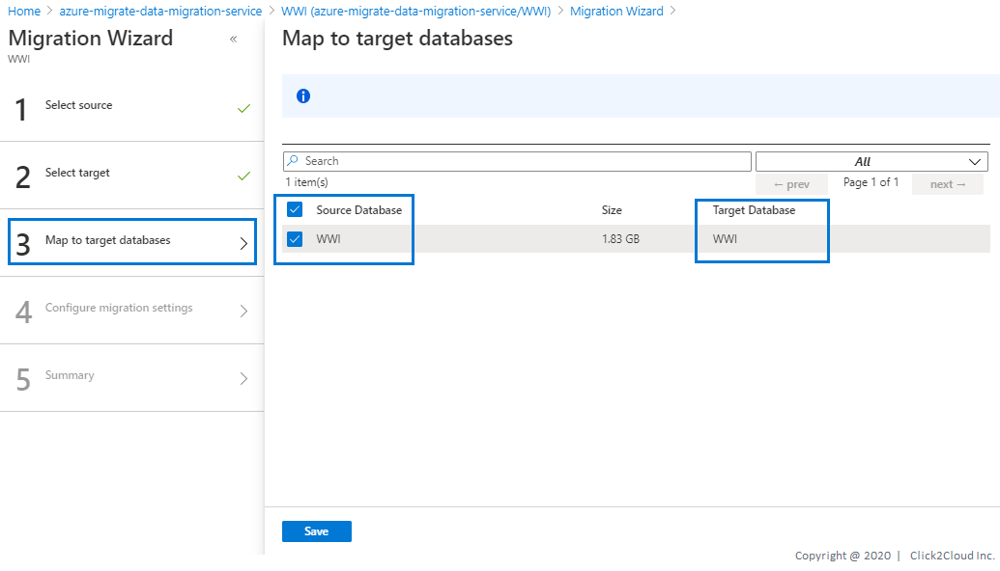
</kbd>

10. On the **Select tables** screen, expand the table listing, and then review the list of affected fields. Click on **Save**

    Azure Database Migration Service auto selects all the empty source tables that exist on the target Azure SQL Database instance. If you want to remigrate tables that already include data, you need to explicitly select the tables on this blade.

<kbd>
  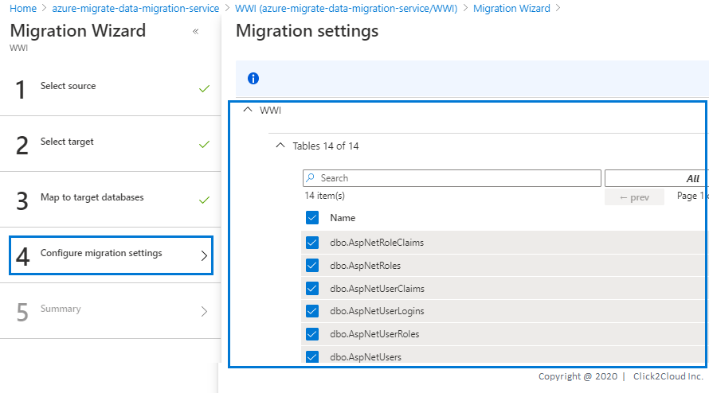
</kbd>

11. On the **Migration summary** screen, in the Activity name text box, specify a name for the migration activity.

<kbd>
  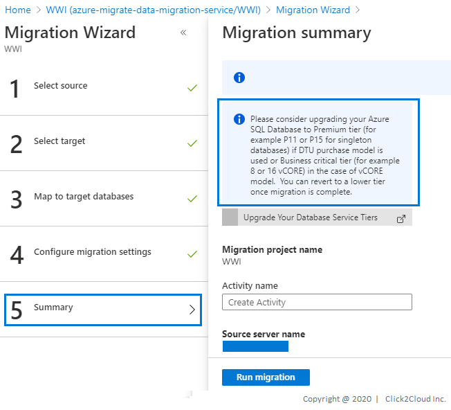
</kbd>

14. Review the summary to ensure that the source and target details match what you previously specified. Click on **Run Migration**. 

<kbd>
  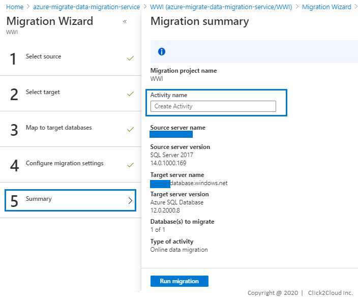
</kbd>

15. The **migration activity** window appears, and the Status of the activity is **Initializing**.

<kbd>
  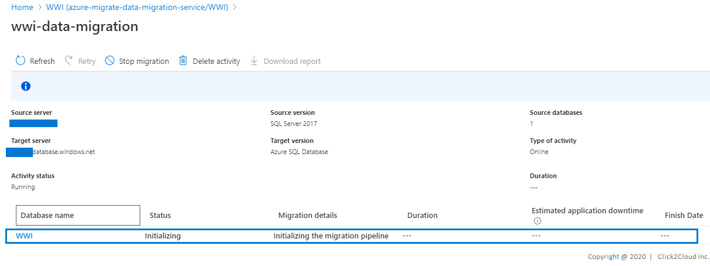
</kbd>

16. On the **migration activity** screen, select **Refresh** to update the display until the **Status** of the migration shows as **Running** and Migation details as **Ready to cutover**.

<kbd>
  
</kbd>

17. On the **migration activity** screen,Click on Name of the Database for more details about **cutover** and click on Start Cutover.

<kbd>
  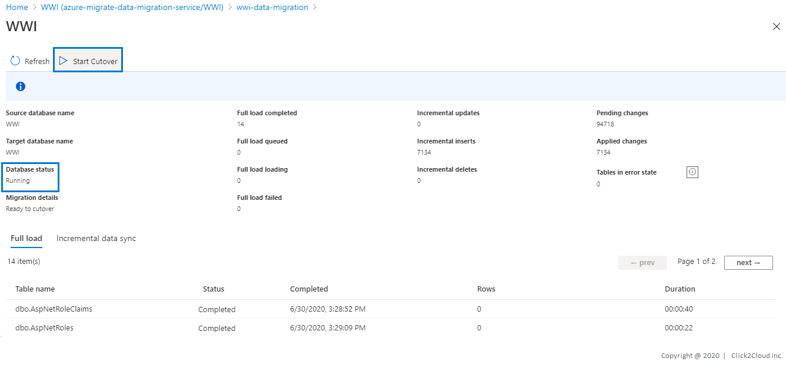
</kbd>

18. When you are ready to do the migration cutover, perform the following steps to complete the database migration. 
    * Please note that the database is ready for cutover only after the full data load is completed.
    * Stop all the incoming transactions coming to the source database.
    * Wait until all the pending transactions have been applied to the target database. At that time the pending changes counter will set to 0:
    * Reconnect your applications to the new Azure target database.

<kbd>
  
</kbd>

<kbd>
  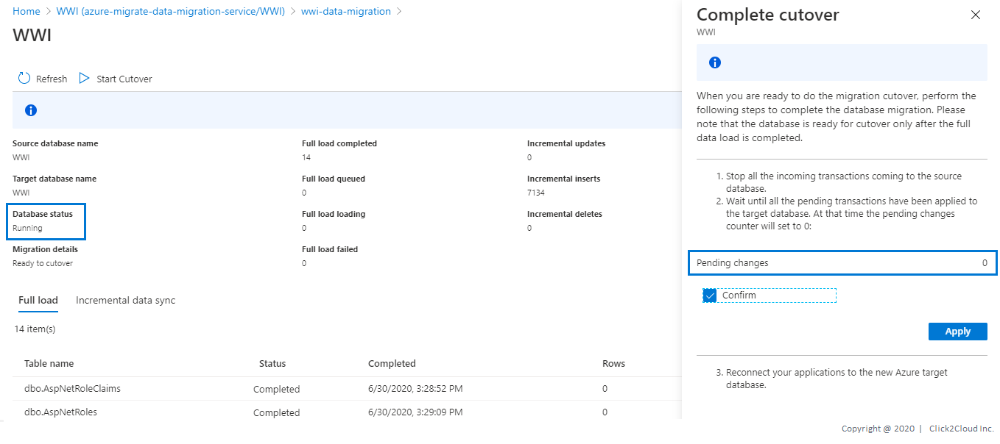
</kbd>

19. Click on **Apply** to start the Cutover.

<kbd>
  
</kbd>

<kbd>
  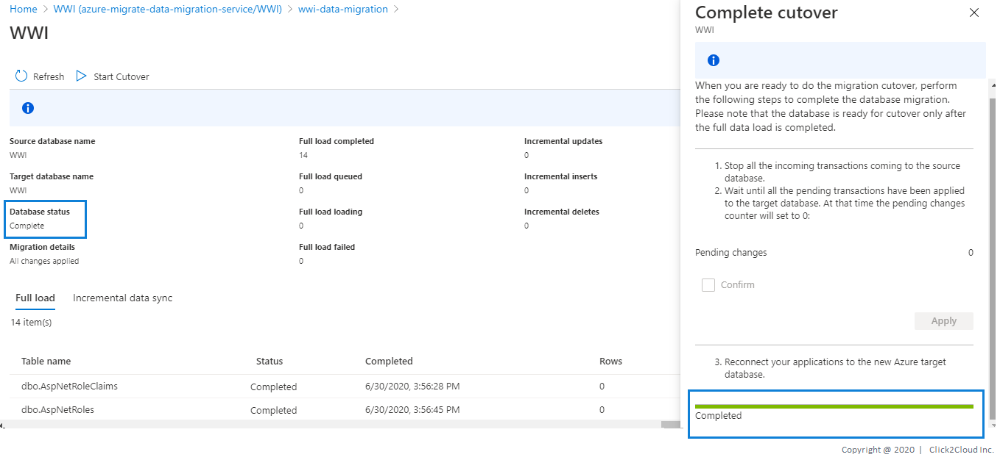
</kbd>

Verify the target database(s) on the target **Azure SQL Database**.

> Congratulations ! You are now ready with your Database on Azure Cloud. 