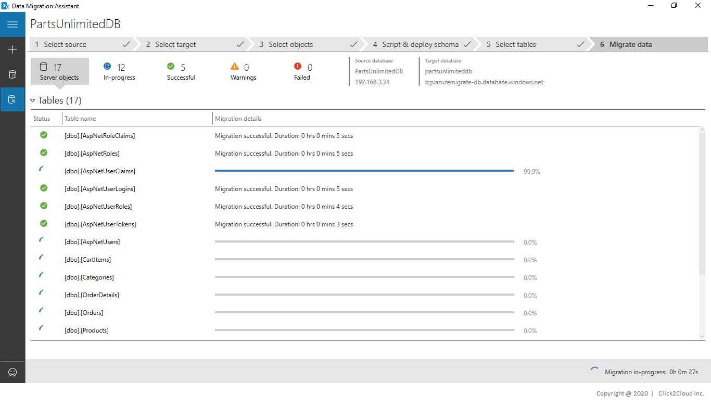
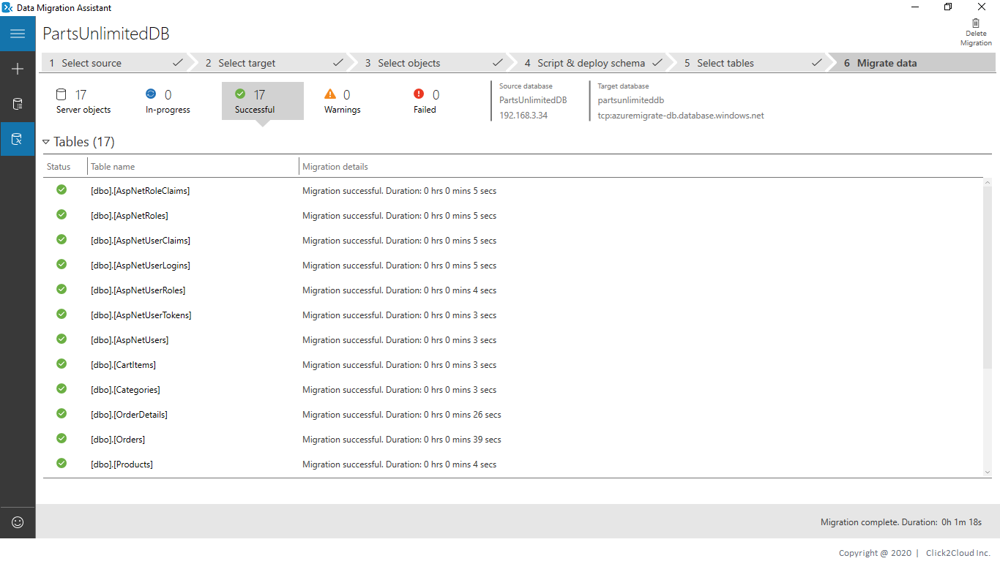
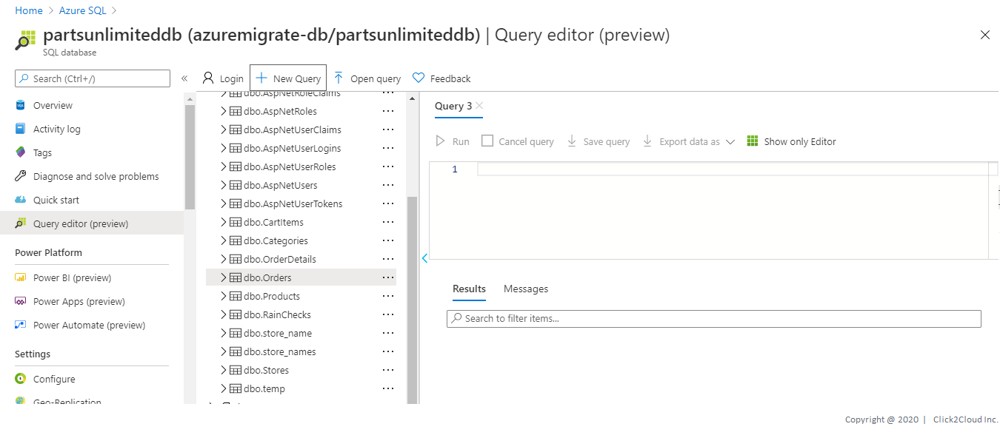

# Partsunlimited Database Migration
The database that will be migrated is hosted on a Windows server 2016.

Migration Scenario - App Modernization
* SQL Server 2019 - Database migration to Azure SQL Server using Azure Database Migration Service

Technologies used:
 - Microsoft SQL Server 2019

## Steps for Database Migration using Data Migration Assistant

The Data Migration Assistant (DMA) helps you upgrade to a modern data platform by detecting compatibility issues that can impact database functionality in your new version of SQL Server or Azure SQL Database. DMA recommends performance and reliability improvements for your target environment and allows you to move your schema, data, and uncontained objects from your source server to your target server.

1. Create an migration project.
   1. On the left, select the + icon, and then select the migration **Project type**.
   2. Specify the project name, and then select the source server and target server types.
   3. Click on **Create**.

<kbd>
  
</kbd>

2. Enter source server details and connect to it then Select single database from your source server to migrate to Azure SQL Database and click **Next**

<kbd>
  
</kbd>

3. Enter target server details and connect to it then Select single database from your target Azure SQL Database Server and click **Next**

<kbd>
  
</kbd>

4. Wait while Preparing source databse schema.

<kbd>
  
</kbd>

5. Select the schema objects from your source databse that you want to migrate to Azure SQL Database.

<kbd>
  
</kbd>

6. The script was generated for the selected schema objects. Review the script, make edits if neccessary, and click **Deploy Schema** to deploy to Azure SQL Database.

<kbd>
  
</kbd>

<kbd>
  
</kbd>

7. After deploying schema, you can also redploy it by clicking **Redploy schema**, Next Click on **Migrate data** to start the Data migration.

<kbd>
   
</kbd>

8. Select the tables containing data you would like to migrate to Azure SQL Database and click on **Start data migration**

<kbd>
   
</kbd>

<kbd>
   
</kbd>

<kbd>
   
</kbd>

9. Log in to the azure console, Serach for **Azure SQL** and click on **Azure SQL**, then click on the Azure SQL Databse from list where you have migrated source server Database.

<kbd>
  
</kbd>

10. Click on **Query editor** to verify schema and data migrated successfully.

<kbd>
   
</kbd>

> Congratulations ! You are now ready with your Database on Azure SQL Server. 