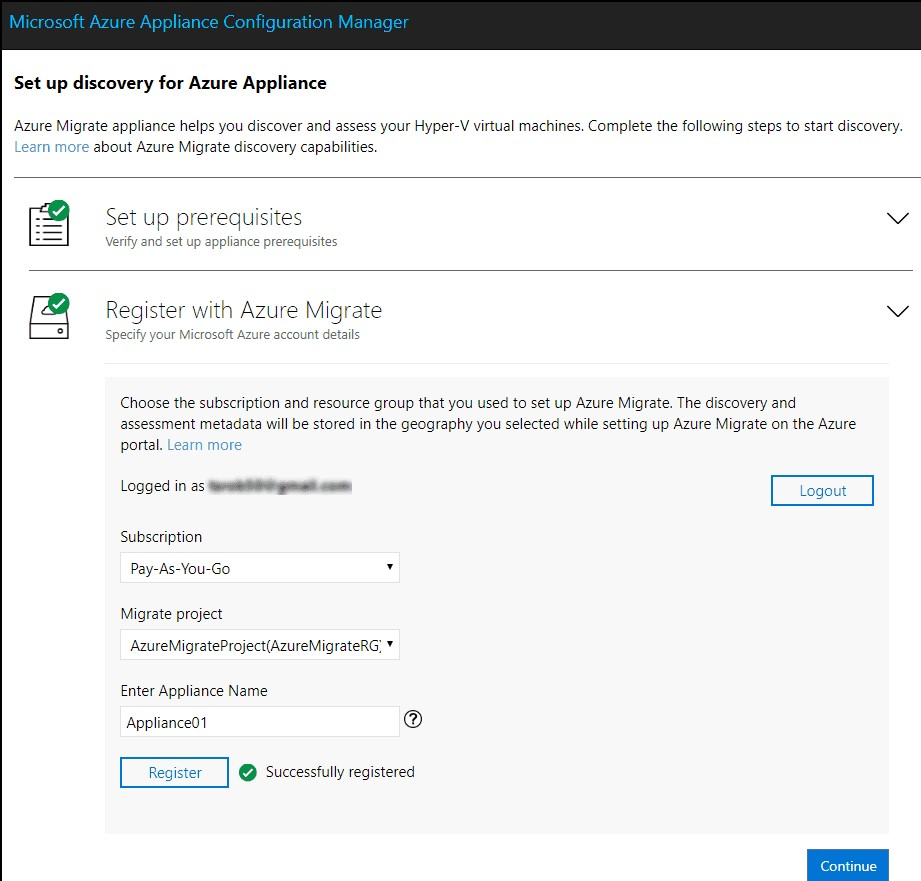
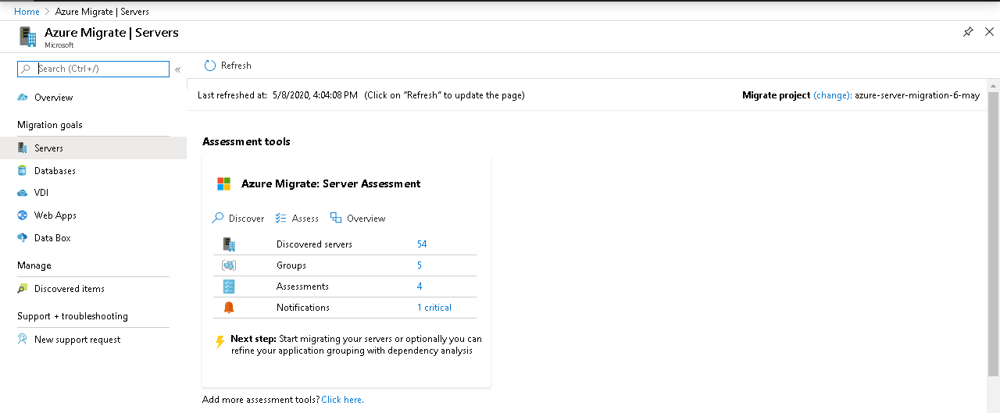

# Appliance Setup

1. Setup VM for Azure Appliance on vCenter for assessment. Setup Credentials for Linux and Windows machine.

<kbd>
  
</kbd>

<kbd>
  
</kbd>

>- Appliance setup instructions can be found here: https://docs.microsoft.com/en-us/azure/migrate/how-to-set-up-appliance-vmware

2. Discovered servers can be seen on the portal.

<kbd>
  
</kbd>

3. To view application dependencies you will have to install dependency agent in each VM.
>- Agent installation instructions can be found here: https://docs.microsoft.com/en-us/azure/migrate/how-to-create-group-machine-dependencies
