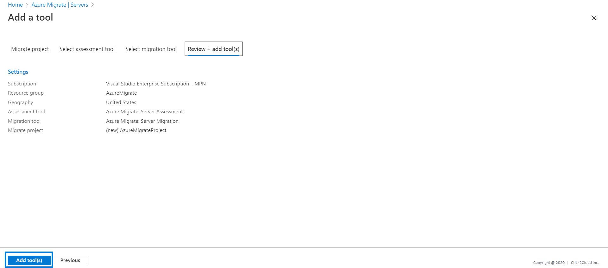

# Appliance Setup

1. Log in to the azure console, Search for **Azure Migrate** and click on **Azure Migrate**.

<kbd>
  
</kbd>

2. Under **Discover**, **assess and migrate servers**, click **Assess and migrate servers**.

<kbd>
  
</kbd>

3. Click **Add tools**.

<kbd>
  
</kbd>

4. In **Migrate project**, select your Azure subscription, and create a resource group if you don't have one.  
In **Project Details**, specify the project name, and geography in which you want to create the project.

<kbd>
  
</kbd>

5. Click **Next**, and add an assessment or migration tool.

<kbd>
  
</kbd>

<kbd>
  
</kbd>

6. In **Review + add tools**, review the settings, and click **Add tools**.

<kbd>
  
</kbd>

7. Setup VM for Azure Appliance on Azure for assessment. Setup Credentials for Linux and Windows machine.
>- Appliance setup instructions can be found [here](https://docs.microsoft.com/en-us/azure/migrate/how-to-set-up-appliance-physical).

<kbd>
  
</kbd>

>- Observe ‘Prerequisites Set up’.

<kbd>
  
</kbd>

>- Observe the message.

<kbd>
  
</kbd>

>- Now we will generate the key required to register the appliance.

<kbd>
  
</kbd>

>- Select ‘Physical or other’ from the drop down.

<kbd>
  
</kbd>

>- Type name of appliance and click ‘Generate key’ then copy Azure Migrate project key.

<kbd>
  
</kbd>

>- Paste the Azure Migrate project key copied from previous step and Click ‘Login’.

<kbd>
  
</kbd>

>- Observe Status.

<kbd>
  
</kbd>

>- Click Add credentials.

<kbd>
  
</kbd>

>- Add credentials and click on save.

<kbd>
  
</kbd>

8. Enter the IPs with created friendly name credentials name for Server Discovery. 

>- Click Add discovery source.

<kbd>
  
</kbd>

>- Select Add multiple items and type comma separated Server Private IP and created friendly name credentials.

<kbd>
  
</kbd>

>- Observe Status.

<kbd>
  
</kbd>

9. Click **Start Discovery** and you can view the discovered virtual machines on the Azure Portal after the appliance is configured and discovery is done.
  
>- Click Start discovery.

<kbd>
  
</kbd>

>- Observe the ‘Status’.

<kbd>
  
</kbd>

<kbd>
  
</kbd>
