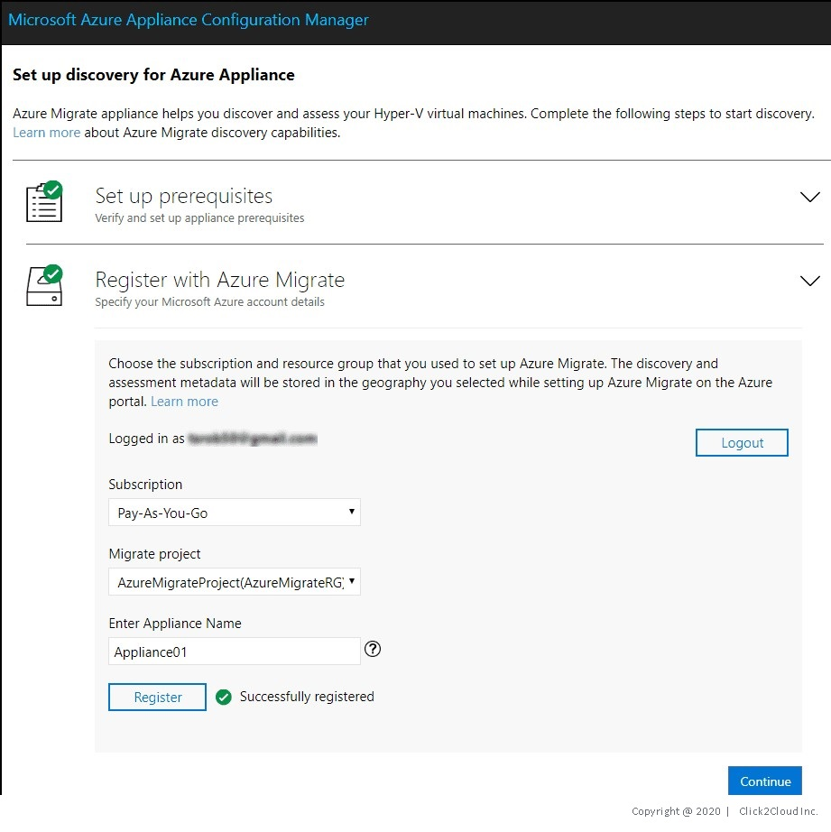
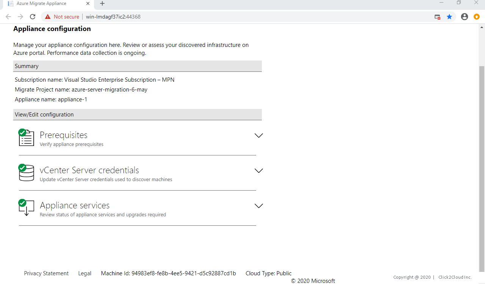
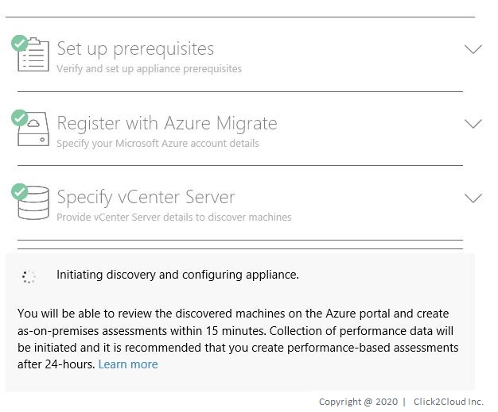

# Appliance Setup

1. Log in to the azure console, Search for **Azure Migrate** and click on **Azure Migrate**.

<kbd>
  
</kbd>

2. Under **Discover**, **assess and migrate servers**, click **Assess and migrate servers**.

<kbd>
  
</kbd>

3. Click **Add tools**.

<kbd>
  
</kbd>

4. In **Migrate project**, select your Azure subscription, and create a resource group if you don't have one.  
In **Project Details**, specify the project name, and geography in which you want to create the project.

<kbd>
  
</kbd>

5. Click **Next**, and add an assessment or migration tool.

<kbd>
  
</kbd>

<kbd>
  
</kbd>

6. In **Review + add tools**, review the settings, and click **Add tools**.

<kbd>
  
</kbd>

7. Setup VM for Azure Appliance on vCenter for assessment. Setup Credentials for Linux and Windows machine.
>- Appliance setup instructions can be found [here](https://docs.microsoft.com/en-us/azure/migrate/how-to-set-up-appliance-vmware).

<kbd>
  
</kbd>

<kbd>
  
</kbd>

8. You can view the discovered machines after the appliance is configured and discovery is done.

<kbd>
  
</kbd>
