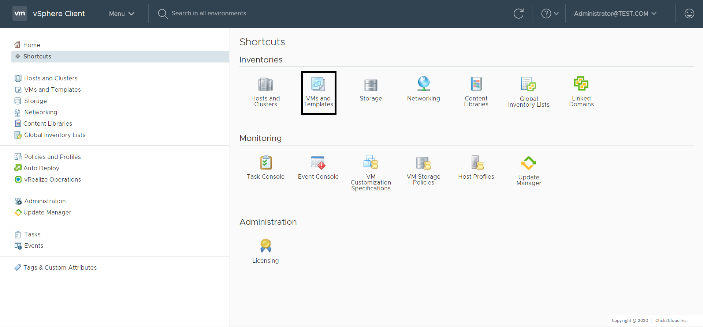
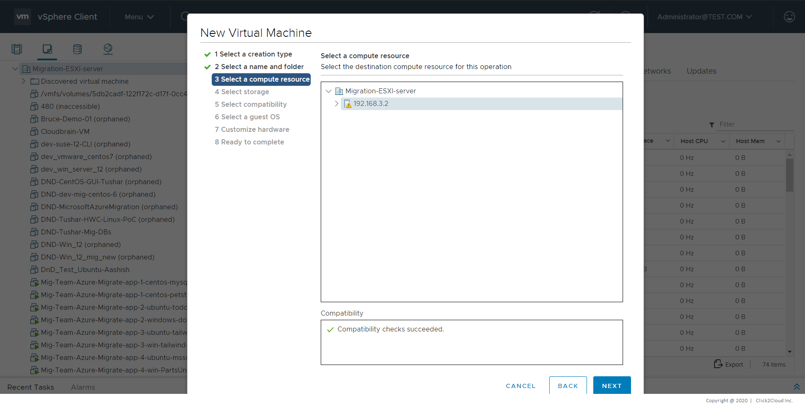
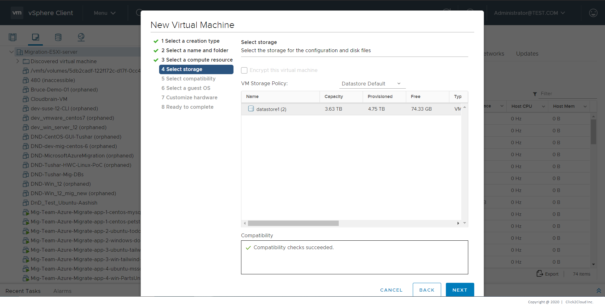
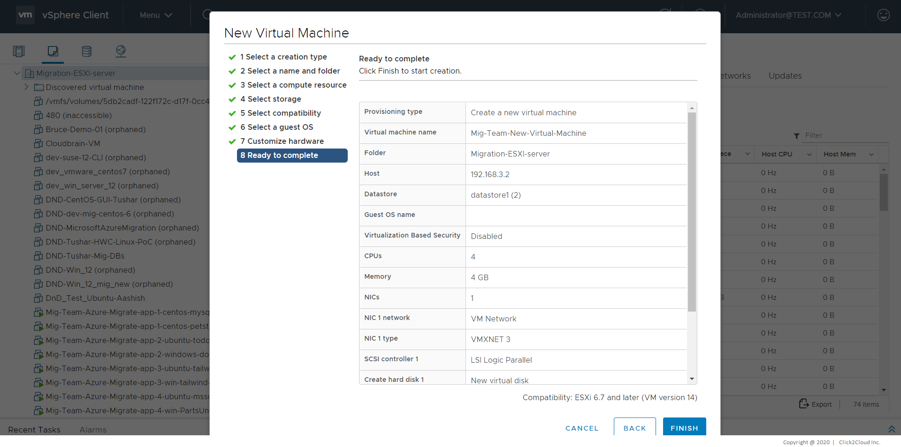

# Steps for Centos 7 Template Creation

1. Download Centos 7 ISO from [here](http://centos.hbcse.tifr.res.in/centos/7.8.2003/isos/x86_64/)

2. Upload it to your VMware vCenter.

    **Procedure**  
    1. Click **Storage** in the VMware Host Client inventory and click **Datastores**.  
    
    
<kbd>
        
    </kbd>

    
    2. Click **Datastore browser**.  
    
    
<kbd>
        
    </kbd>

    
    3. Select the datastore that you want to store the file on.  
    4. **(Optional)** Click **New Folder** to create a new datastore directory to store the file.  
    5. Select the target folder and click **Upload Files**.  
    6. Locate the item that you want to upload from your local computer and click **Open**.  
    7. The file uploads to the datastore that you selected.  
    8. **(Optional)** Refresh the datastore file   browser to see the uploaded file on the list.

3. Create VM using the uploaded ISO file.

    **Procedure**  
    1. Click **VMs and Templates** in the VMware Host Client inventory, click **Actions** and select **New Virtual Machine**.  
    
    
<kbd>
        
    </kbd>

    
    
<kbd>
        
    </kbd>

    
    2. On the Select a creation type page, select **Create a new virtual machine** and click **Next**.  
    
    
<kbd>
        
    </kbd>

    
    3. On the Select a name and folder page, enter a unique name for the virtual machine and select a deployment location.     
    4. On the Select a compute resource page, select the host, cluster, resource pool, or vApp where the virtual machine will run and click **Next**.  
    
    
<kbd>
        
    </kbd>

    
    5. On the Select storage page, choose the storage type, the storage policy, and a datastore or datastore cluster where you have uploaded ISO file in Step 2. 
    
<kbd>
        
    </kbd>
 
    
    6. On the Select compatibility page, select the virtual machine compatibility with ESXi host versions and click **Next**.

    7. On the Select a guest OS page, select the guest OS family as *Linux* and version as *CentOS 7 (64 bit)* and click **Next**.

    
<kbd>
        
    </kbd>

    8. On the Customize hardware page, configure the virtual machine hardware and options, in *New CD/DVD Drive* option select option for *Datastore ISO File* and choose the ISO file uploaded in Step 2 and click **Next**.  
    
    
<kbd>
        
    </kbd>
 
    
    9. On the Ready to complete page, review the details and click **Finish**.  
    
    
<kbd>
        
    </kbd>
 
    
    10. The virtual machine appears in the vSphere Client inventory.
    
4. After the virtual machine is created, you will have to install Centos 7 (64 bit) OS on it.  
    **Installation Steps**
    1. Upon booting the **CentOS 7 ISO** file, you can begin the installation process. To do so, select **Install CentOS 7**. That will start the installer’s graphical interface.

    
<kbd>
        
    </kbd>

    2. Before starting the installation process itself, select which language you would like to use during installation. **The default option is English.**

    
<kbd>
        
    </kbd>

    3. **Click Continue** to confirm your selection.
    There are a couple of settings you would want to configure. All items marked with a warning icon must be configured before you begin the installation.

    
<kbd>
        
    </kbd>

    4. **Set Date and Time** To set a date and time for the system, click the Date & Time icon under the Localization heading. Select a region/time zone on the map of the world as seen below. Once you have selected your time zone, hit **Done** to save your changes.

    
<kbd>
        
    </kbd>

    5. **System Language** Next, select the Language Support option under the Localization heading. The language selected in the Welcome to CentOS 7 window will be the default system language. If necessary, select additional languages and hit the ***Done*** button once you are finished.

    
<kbd>
        
    </kbd>

    6. **Software Selection** Select the Software Selection option under the Software heading. You will see a list of predefined Base Environment options and optional add-ons. This part entirely depends on your needs.
        - **Minimal Install.** This is the most flexible and least resource-demanding option. Excellent for production environment servers. Be prepared to customize the environment.
        - **Predefined Server Options.** If you are 100% certain about the role of your server and don’t want to customize it for its role, select one of the predefined server environments.
        - **GNOME Desktop and KDE Plasma Workspaces.** These environments include a full graphical user interface.
    
        When you have selected the base environment and optional add-ons, click the **Done** button. Wait for the system to check for software dependencies before you move on to the next option.
    
    
<kbd>
        
    </kbd>

    7. **Select Installation Destination** Click the Installation Destination option under the System heading. Check your machine’s storage under the Local Standard Disks heading. *CentOS 7 will be installed on the selected disk.*
    
        **Partitioning**
        - **Option 1: Automatic Partitioning** Under the Other Storage Options heading, select the **Automatically configure partitioning checkbox**. This ensures the selected destination storage disk will automatically partition with the **/(root), /home and swap partitions**. It will automatically create an LVM logical volume in the **XFS file system**.
        If you do not have enough free space, you can reclaim disk space and instruct the system to delete files. When finished, click the **Done** button.
        - **Option 2: Manual Partitioning** Select the **I will configure partitioning checkbox** and choose **Done**. If you want to use other file systems **(such as ext4 and vfat)** and a non-LVM partitioning scheme, such as **btrfs**. This will initiate a configuration pop-up where you can set up your partitioning manually. This is an advanced setting option, very much based on your requirements.
    
    
<kbd>
        
    </kbd>

    8. **Network and Hostname** Click the Network & Host Name option under the System heading. For the hostname, type in the fully qualified domain name of your system.

    
<kbd>
        
    </kbd>

    9. **Select Configure…** and select to add IPv4 settings or IPv6 settings depending on what you have. Add **static IP addresses** to help identify your computer on the network. Bear in mind that your network environment’s settings define these values.
    
        **To add a static IP address**
        - Select **Manual** from the Method drop-down.
        - Click the **Add** button to add a static IP address.
        - Enter the information for your network domain.
            - IP Address
            - Netmask Address
            - Gateway Address
            - DNS Servers Address
        - Click **Save** to confirm your changes.

        By default, all detected Ethernet connections are disabled. Click the **ON/OFF** toggle to enable the connection.
    
    
<kbd>
        
    </kbd>

    10. **Security Policy** Select the Security Policy option under the System heading. Choose a profile from the list and hit **Select** profile. Hit the **Done** button to confirm your selection.

    11. **Start the Installation Process** Once everything is set up according to your liking, hit **Begin Installation** to start the install. This will start the initial installation process.

     
<kbd>
        
    </kbd>

    12. **Define Root Password** To define the root user, 
        - select the Root Password icon.
        - Select a Root Password and re-enter it in **Confirm** field.
        - Root user accounts should consist of at least 12 characters, including uppercase and lowercase letters, numbers, and special characters.
        - Click the **Done** button to proceed.
    
     
<kbd>
        
    </kbd>

    13. Wait for the installation process to complete.
    Before you start using your new CentOS installation, reboot the system. Click the **Reboot** button.

     
<kbd>
        
    </kbd>

    > Log into the system by using the credentials you defined previously.
