# Steps for Ubuntu 16.04 Template Creation

1. Download Ubuntu 16.04 ISO from [here](https://releases.ubuntu.com/16.04/ubuntu-16.04.6-desktop-amd64.iso)

2. Upload it to your VMware vCenter.

    **Procedure**  
    1. Click **Storage** in the VMware Host Client inventory and click **Datastores**.  
    
    
<kbd>
        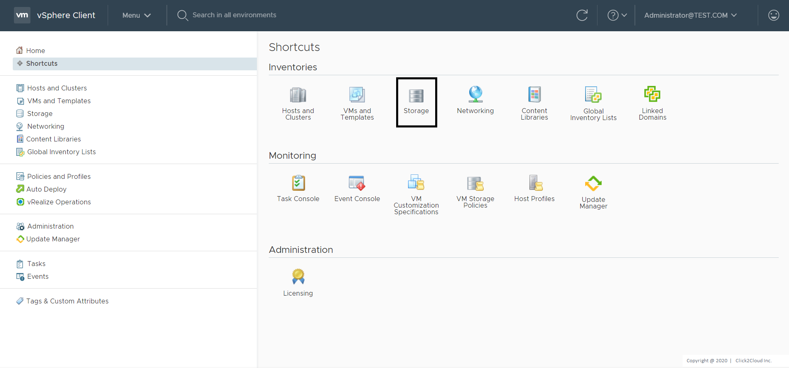
    </kbd>

    
    2. Click **Datastore browser**.  
    
    
<kbd>
        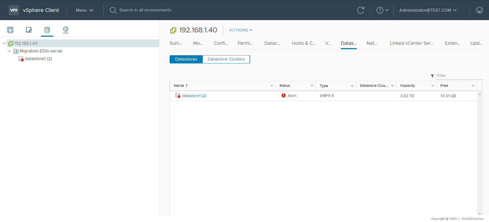
    </kbd>

    
    3. Select the datastore that you want to store the file on.  
    4. **(Optional)** Click **New Folder** to create a new datastore directory to store the file.  
    5. Select the target folder and click **Upload Files**.  
    6. Locate the item that you want to upload from your local computer and click **Open**.  
    7. The file uploads to the datastore that you selected.  
    8. **(Optional)** Refresh the datastore file   browser to see the uploaded file on the list.

3. Create VM using the uploaded ISO file.

    **Procedure**  
    1. Click **VMs and Templates** in the VMware Host Client inventory, click **Actions** and select **New Virtual Machine**.  
    
    
<kbd>
        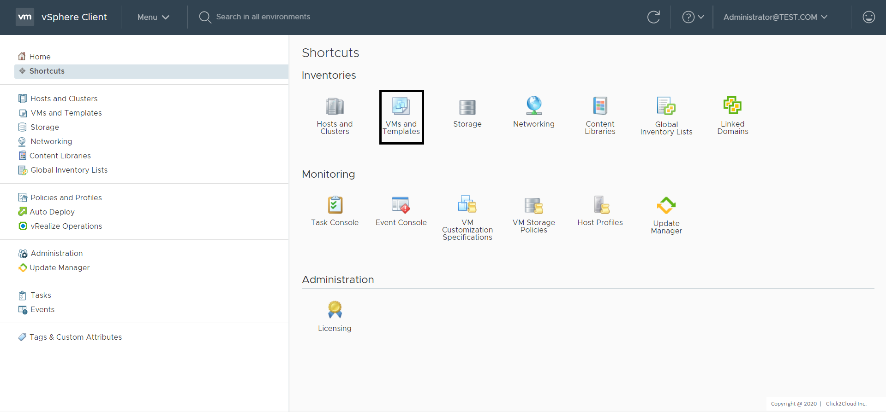
    </kbd>

    
    
<kbd>
        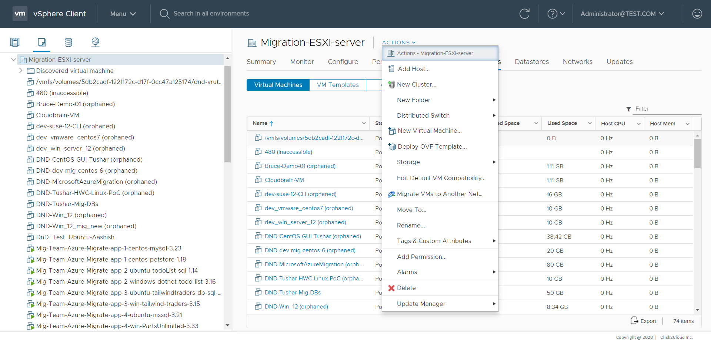
    </kbd>

    
    2. On the Select a creation type page, select **Create a new virtual machine** and click **Next**.  
    
    
<kbd>
        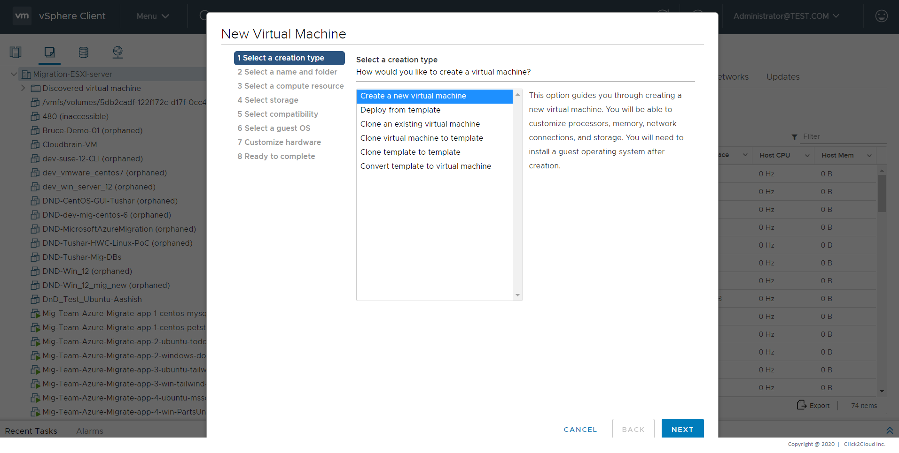
    </kbd>

    
    3. On the Select a name and folder page, enter a unique name for the virtual machine and select a deployment location.     
    4. On the Select a compute resource page, select the host, cluster, resource pool, or vApp where the virtual machine will run and click **Next**.  
    
    
<kbd>
        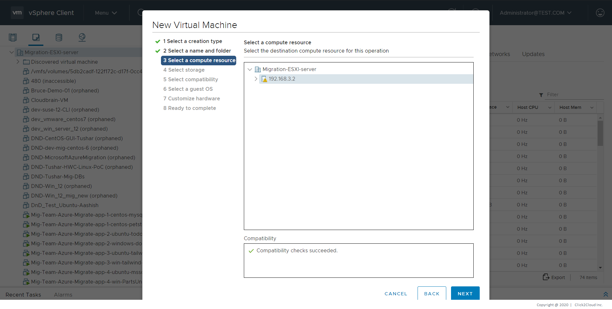
    </kbd>

    
    5. On the Select storage page, choose the storage type, the storage policy, and a datastore or datastore cluster where you have uploaded ISO file in Step 2. 
    
<kbd>
        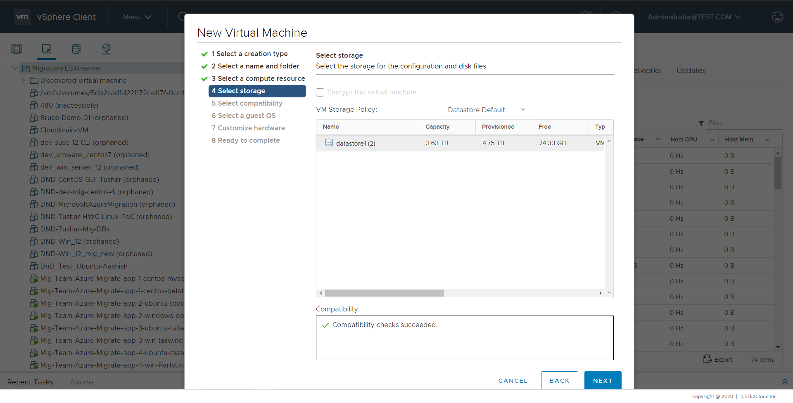
    </kbd>
 
    
    6. On the Select compatibility page, select the virtual machine compatibility with ESXi host versions and click **Next**.  
         
    7. On the Select a guest OS page, select the guest OS family as *Linux* and version as *Ubuntu Linux (64-bit)* and click **Next**.  
    
    
<kbd>
        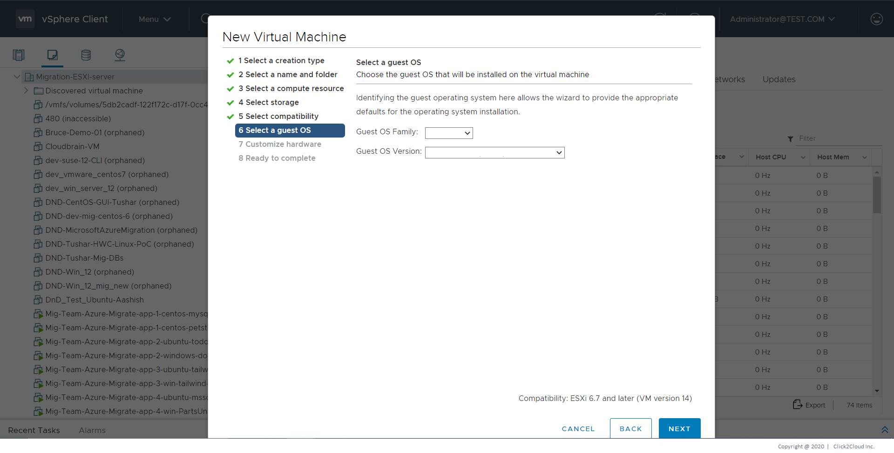
    </kbd>
 
    
    8. On the Customize hardware page, configure the virtual machine hardware and options, in *New CD/DVD Drive* option select option for *Datastore ISO File* and choose the ISO file uploaded in Step 2 and click **Next**.  
    
    
<kbd>
        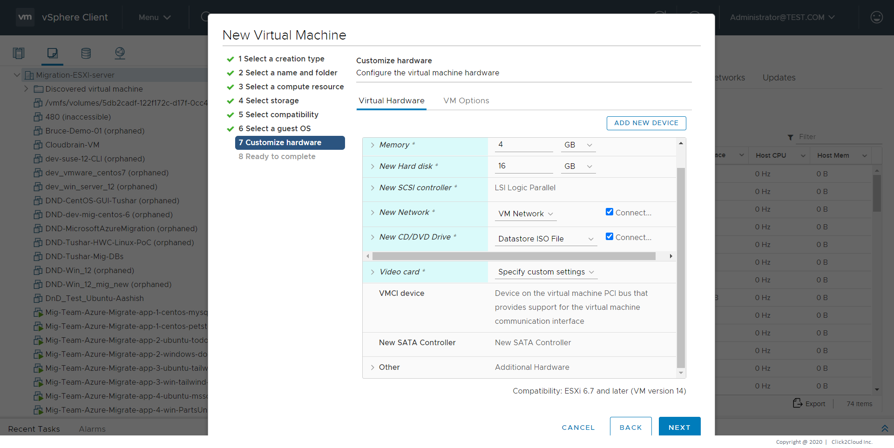
    </kbd>
 
    
    9. On the Ready to complete page, review the details and click **Finish**.  
    
    
<kbd>
        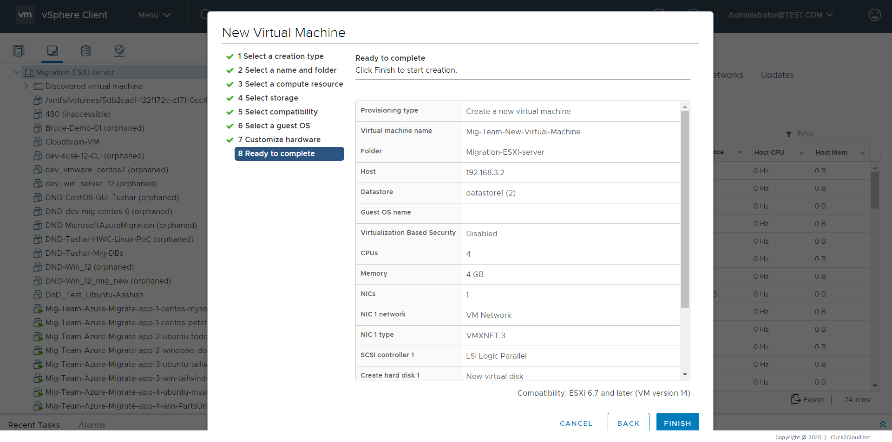
    </kbd>
 
    
    10. The virtual machine appears in the vSphere Client inventory.  
    
4. After the virtual machine is created, you will have to install Ubuntu Linux Server 16.04 OS on it.  
    **Installation Steps**
    1. You will see the following language selection screen appear. Using the keyboard **Arrow** keys, select the language you would like to use and press **Enter**. For this demo we will be using the default, **English**.
    
    
<kbd>
        
    </kbd>

    
    2. Next you will be asked to select an action.  
    Since we are installing Linux we will choose the default Install Ubuntu Server by pressing **Enter**.
    
    
<kbd>
        
    </kbd>

    
    3. After selecting installation language, geographical location and keyboard layout, the installer will perform some background configuration and processing. In particular, the installer will attempt to automatically configure your network.  
    If the installer successfully detects your network configuration, you’ll be asked to enter a hostname, which can either be modified or left as the default ‘ubuntu’.
    
    
<kbd>
        
    </kbd>

    
    4. After networking, you’ll be asked to enter your full name, username and password. As you’re configuring a server that’s likely to be accessible from the internet, make sure your password is strong and difficult to guess.
    
    
<kbd>
        
    </kbd>

    
    5. After answering a question about your time zone, you need to configure local storage.  
    If the storage connected to your server is raw and unformatted, the installer will detect this and present a menu offering four options. The simplest is the second, ‘Guided - use entire disk and set up LVM’, and we’d recommend selecting this.  
    Any of these options will obviously destroy any data currently on your partition(s), but resizing and creating new partitions are options available by selecting ‘Manual’.
    
    
<kbd>
        
    </kbd>

    
    6. After accepting the changes that are going to be made to your storage, the installer will determine the packages to be installed. This will take a few moments.  
    You will then be asked to enter an HTTP proxy address. This can be ignored if you don’t know whether you need one to access the internet from your server. You’ll also be asked whether you require automatic updates. Selecting ‘Install security updates automatically’ is the safest default option.
    
    
<kbd>
        
    </kbd>

    
    7. The final step before installation starts requires you to select the software you want pre-installed on your server. You can select from a broad set of categories or manually choose the packages yourself. This option is purely for convenience, as you can easily install any additional software you need after installation has completed.  
    We’d recommend selecting ‘standard system utilities’ and ‘OpenSSH server’ as a minimum so that your system is both fully functional and accessible from any SSH client on your local network.
    
    
<kbd>
        
    </kbd>

    
    8. Ubuntu Server will now be installed. When complete, one final question asks for permission to install the GRUB boot loader. You should answer ‘Yes’.  
    The installer will finish up by installing the final packages and configuration files.
    
    
<kbd>
        
    </kbd>

    
    9. The installation is complete!  
    The installer will now prompt you to reboot the computer.  
    Select **<Continue>** to reboot into Ubuntu Linux Server.
    
    
<kbd>
        
    </kbd>

    
    10. If all goes well in a few minutes you will see a login prompt.  
    You can now log in using the user name and password you configured.
    32. Enable root user login using following steps: 
        1. Set password for root user using command **sudo passwd root** 
        2. Open file using **sudo nano /etc/ssh/sshd_config**
        2. Change PermitRootLogin prohibit-password to PermitRootLogin yes 
        3. Restart ssh service using **sudo service ssh restart**
        
5. Create a template using the VM.

    **Procedure**  
    1. Click **VMs and Templates** in the VMware Host Client inventory. 
    
    
<kbd>
        
    </kbd>

     
    2. Right click on the VM created in Step 4 and select **Clone > Clone to Template**.
    
    
<kbd>
        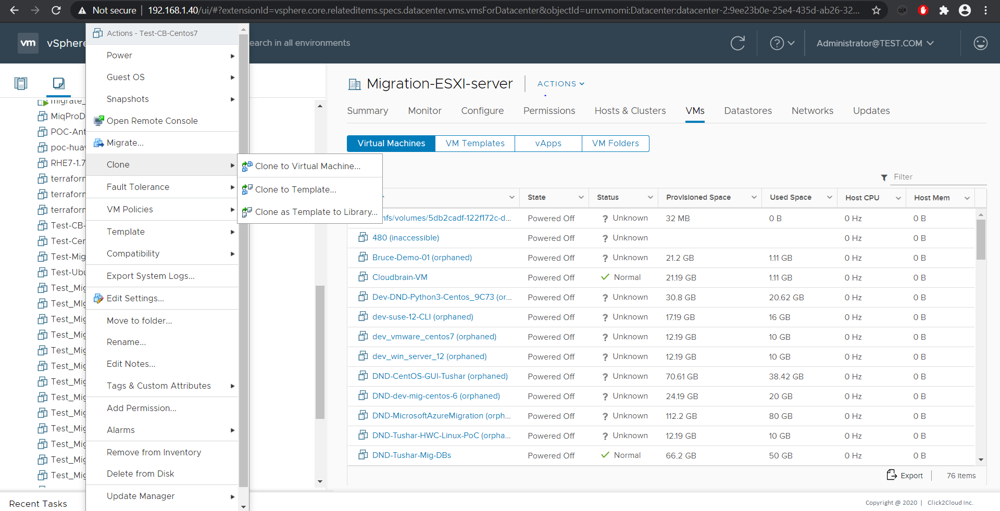
    </kbd>

    
    3. On the Select a name and folder page, enter a name for the template and select a data center or a folder in which to deploy it.
    
    
<kbd>
        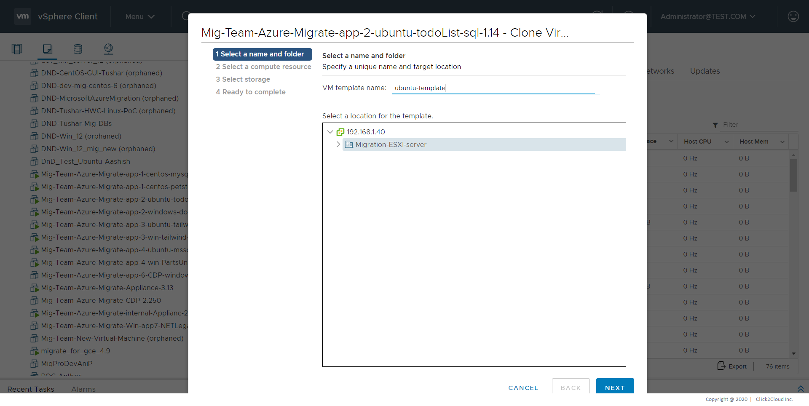
    </kbd>

    
    4. On the Select a compute resource, select a host or a cluster resource for the template.
    
    
<kbd>
        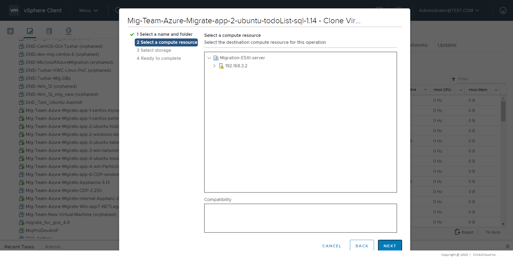
    </kbd>

    
    5. On the Select storage page, select the datastore or datastore cluster in which to store the virtual machine configuration files and all of the virtual disks. Click Next.
    
    6. On the Ready to complete page, review the template settings and click **Finish**.  
    
     
<kbd>
        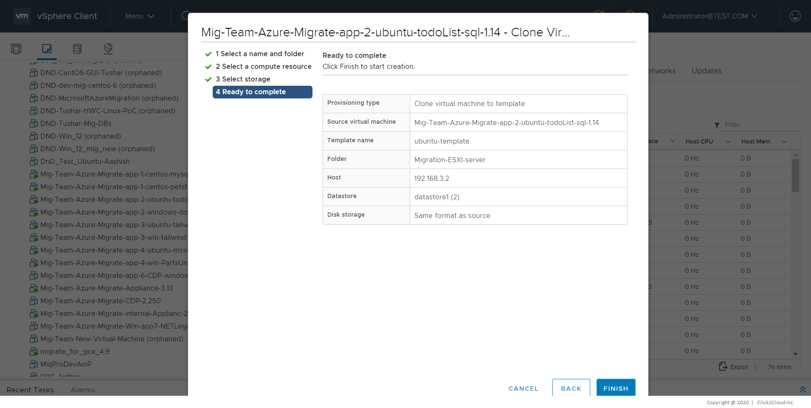
    </kbd>

    
    The progress of the clone task appears in the Recent Tasks pane. When the task completes, the template appears in the inventory.