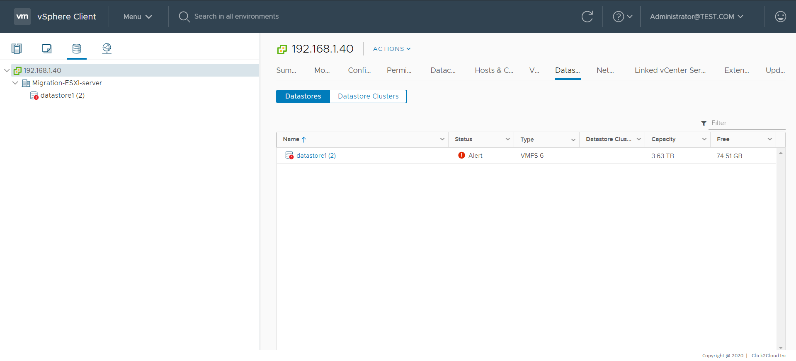
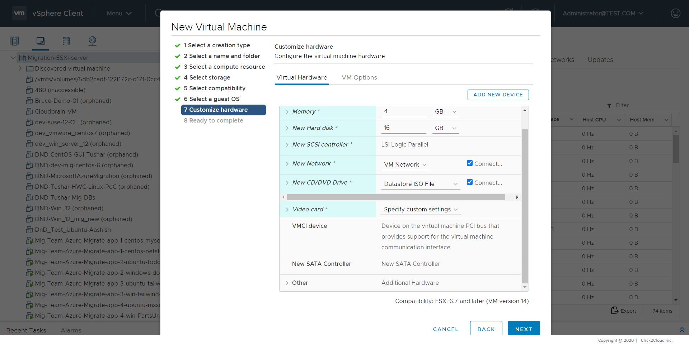

# Steps for Ubuntu 16.04 Template Creation

1. Download Ubuntu 16.04 ISO from [here](https://software-download.microsoft.com/download/pr/Windows_Server_2016_Datacenter_EVAL_en-us_14393_refresh.ISO)

2. Upload it to your VMware vCenter.

    **Procedure**  
    1. Click **Storage** in the VMware Host Client inventory and click **Datastores**.  
    
    
<kbd>
        
    </kbd>

    
    2. Click **Datastore browser**.  
    
    
<kbd>
        
    </kbd>

    
    3. Select the datastore that you want to store the file on.  
    4. **(Optional)** Click **New Folder** to create a new datastore directory to store the file.  
    5. Select the target folder and click **Upload Files**.  
    6. Locate the item that you want to upload from your local computer and click **Open**.  
    7. The file uploads to the datastore that you selected.  
    8. **(Optional)** Refresh the datastore file   browser to see the uploaded file on the list.

3. Create VM using the uploaded ISO file.

    **Procedure**  
    1. Click **VMs and Templates** in the VMware Host Client inventory, click **Actions** and select **New Virtual Machine**.  
    
    
<kbd>
        
    </kbd>

    
    
<kbd>
        
    </kbd>

    
    2. On the Select a creation type page, select **Create a new virtual machine** and click **Next**.  
    
    
<kbd>
        
    </kbd>

    
    3. On the Select a name and folder page, enter a unique name for the virtual machine and select a deployment location.     
    4. On the Select a compute resource page, select the host, cluster, resource pool, or vApp where the virtual machine will run and click **Next**.  
    
    
<kbd>
        
    </kbd>

    
    5. On the Select storage page, choose the storage type, the storage policy, and a datastore or datastore cluster where you have uploaded ISO file in Step 2. 
    
<kbd>
        
    </kbd>
 
    
    6. On the Select compatibility page, select the virtual machine compatibility with ESXi host versions and click **Next**.  
         
    7. On the Select a guest OS page, select the guest OS family as *Windows* and version as *Microsoft Windows Server 2016 (64-bit)* and click **Next**.  
    
    
<kbd>
        
    </kbd>
 
    
    8. On the Customize hardware page, configure the virtual machine hardware and options, in *New CD/DVD Drive* option select option for *Datastore ISO File* and choose the ISO file uploaded in Step 2 and click **Next**.  
    
    
<kbd>
        
    </kbd>
 
    
    9. On the Ready to complete page, review the details and click **Finish**.  
    
    
<kbd>
        
    </kbd>
 
    
    10. The virtual machine appears in the vSphere Client inventory.  
    
4. After the virtual machine is created, you will have to install Windows Server 2016 OS on it.  
    **Installation Steps**
    1. At the first screen, choose your Language, Time & currency format and the Keyboard or input method and click **Next**.
    
    
<kbd>
        
    </kbd>

    
    2. Select **Install Now**.
    
    
<kbd>
        
    </kbd>

    
    3. Choose to install the **Windows Server 2016 Standard with the Desktop Experience**. 
    
    
<kbd>
        
    </kbd>

    
    4. Accept the License terms and click **Next**.
    
    
<kbd>
        
    </kbd>

    
    5. Provided that it is a new installation, choose **Custom: Install Windows**.
    
    
<kbd>
        
    </kbd>

    
    6. Then select the disk to install the OS and click **Next**.
    
    
<kbd>
        
    </kbd>

    
    7. Let Windows setup to copy the required files and to finish the installation.
    
    
<kbd>
        
    </kbd>

    
    8. After a few restarts you will be prompted to specify a password for the (standard) Administrator account. Type a password and click **Next**.
    
    
<kbd>
        
    </kbd>

    
    9. When prompted, press **Ctrl + Alt + Delete**, type the Administrator password and press **Enter** to login to your new server.
    
    
<kbd>
        
    </kbd>

    
    10. After you have finished installing the operating system and logged in with a Windows Administrator account, open the VM menu and click Install VMware Tools.  
    
    
<kbd>
        
    </kbd>

    
    You will then see that the virtual DVD of VMware Tools has been loaded into VM’s DVD drive. Tap on the message that will appear to continue. Alternatively, if the message is gone, open File Explorer, enter the contents of the DVD and run Setup.exe.
    
    Run setup64.exe to start the process.
    
    
<kbd>
        
    </kbd>

    
    Click **Next** to continue.
    
    In a typical installation of a VM, select Typical and then Next to continue. For more advanced customization, select Complete or Custom.
    
    
<kbd>
        
    </kbd>

    
    Click the Install button to continue.
    
    
<kbd>
        
    </kbd>

    
    The VMware Tools installation process is in progress. Wait for it to finish.
    
    
<kbd>
        
    </kbd>

    
    Finally, click **Finish** to finish the process.
    
    
<kbd>
        
    </kbd>

    
    VMware Tools will need to restart the VM in order to fully complete the installation of VMware Tools. Click Yes to continue.
    
    11. Open the Windows Explorer and access the folder:  C:\Windows\System32\Sysprep 
    Run **sysprep.exe**
    
    
<kbd>
        
    </kbd>

     
    On the Sysprep application screen, perform the following configuration:
        - System Cleanup Action - Enter System Out-of-Box Experience (OOBE)
        - Generalize - Yes
        - Shutdown Options - Shutdown
    
    
<kbd>
        
    </kbd>

    
    12. Power On the VM, select Language and set password.
        
5. Create a template using the VM.

    **Procedure**  
    1. Click **VMs and Templates** in the VMware Host Client inventory. 
    
    
<kbd>
        
    </kbd>

     
    2. Right click on the VM created in Step 4 and select **Clone > Clone to Template**.
    
    
<kbd>
        
    </kbd>

    
    3. On the Select a name and folder page, enter a name for the template and select a data center or a folder in which to deploy it.
    
    
<kbd>
        
    </kbd>

    
    4. On the Select a compute resource, select a host or a cluster resource for the template.
    
    
<kbd>
        
    </kbd>

    
    5. On the Select storage page, select the datastore or datastore cluster in which to store the virtual machine configuration files and all of the virtual disks. Click Next.
    
    6. On the Ready to complete page, review the template settings and click **Finish**.  
    
     
<kbd>
        
    </kbd>

    
    The progress of the clone task appears in the Recent Tasks pane. When the task completes, the template appears in the inventory.